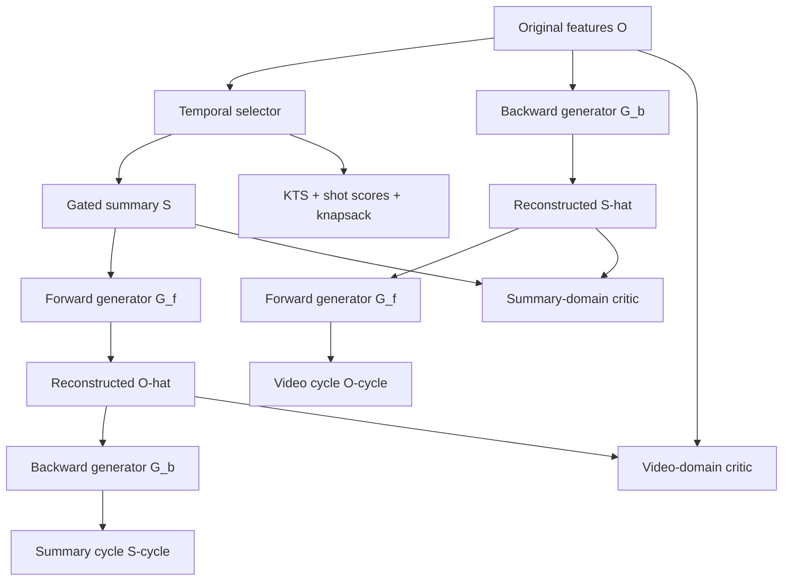
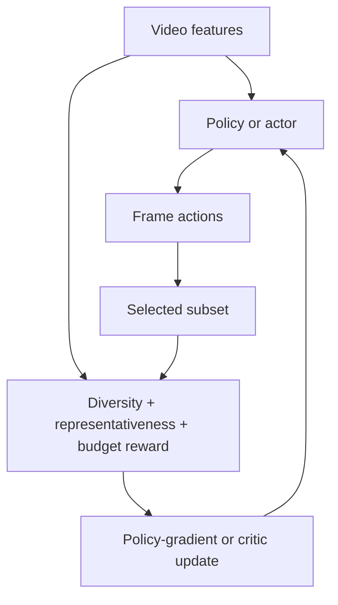
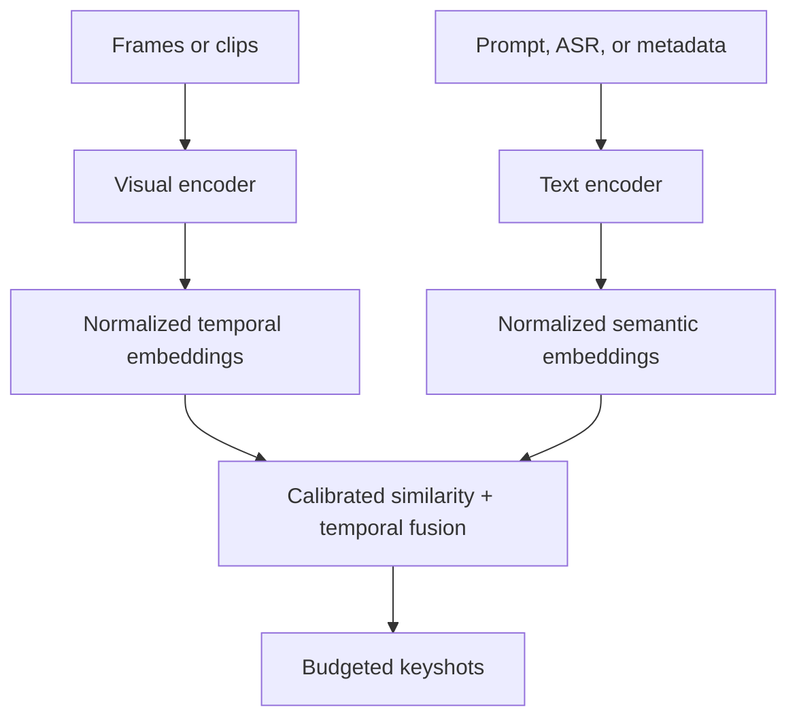
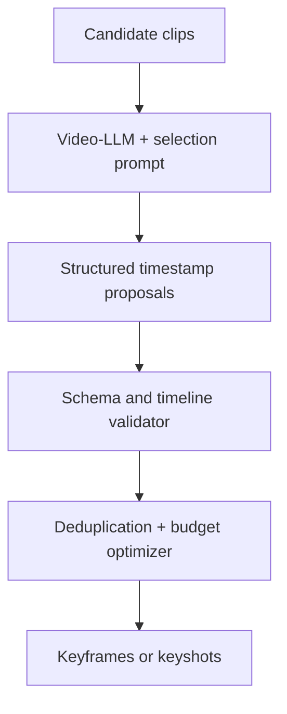

# Awesome Unsupervised Video Summarization

An evidence-audited handbook, implementation guide, and protocol-aware benchmark survey for **extractive video summarization without human summary labels as selector targets**.

**Research and link-audit cut:** 2026-09-06 UTC.

This repository treats a reported score as a tuple—not as a standalone number:

$$
(\text{data},\ \text{split},\ \text{features},\ \text{sampling},\ \text{segmentation},\ \text{budget solver},\ \text{reference aggregation},\ \text{metric}).
$$

Two values are placed in the same leaderboard row only when that tuple is compatible. This is essential on SumMe and TVSum: segmentation, shot-value pooling, summary construction, and user-reference aggregation can move F1 substantially without changing a learned selector.

## Handbook

| Chapter | What it answers |
|---|---|
| [Foundations and architecture blueprints](docs/01-foundations.md) | What is being optimized? What counts as unsupervised, self-supervised, training-free, or zero-shot? How do the four principal system families differ? |
| [Evaluation protocols and failure modes](docs/02-evaluation.md) | How are binary summaries constructed and scored? Why can random-score summaries or simple temporal baselines look competitive? Which protocol details make results incomparable? |
| [Dataset and feature registry](docs/03-datasets.md) | What do SumMe, TVSum, OVP/YouTube, VideoXum, ActivityNet-QA, UT Egocentric, and CoSum actually contain? Where are the authoritative raw data, annotations, and verified feature artifacts? |
| [Reconstruction and generative methods](docs/04-reconstruction-generative.md) | How do SUM-GAN, Cycle-SUM, CSNet, SUM-GAN-AAE, and later reconstruction systems work mathematically, and what is reproducible today? |

The current milestone deliberately goes deep on the shared foundation and the first paradigm. Later paper-ledger expansions will retain the same evidence and protocol requirements.

## Four-paradigm map

Methods are assigned by the **dominant learning signal applied to the selector**. Secondary tags such as `GAN`, `graph`, `audio`, `CLIP`, and `LLM` do not override that rule.

| # | Paradigm | Dominant learning signal | Typical machinery |
|---:|---|---|---|
| 1 | **Reconstruction & Generative** | Preserve enough information to reconstruct the input or match its distribution | AE/VAE, adversarial learning, cycle consistency |
| 2 | **DRL & Heuristic Scoring** | Maximize an explicit subset reward | REINFORCE, actor–critic, clustering, diversity/coverage rewards |
| 3 | **Contrastive & Self-Supervised** | Solve supervision constructed from the video itself | Temporal contrast, masked prediction, mutual-information proxies |
| 4 | **Multimodal Foundation Models & Zero-Shot** | Reuse pretrained semantic alignment or prompted reasoning | CLIP-style scoring, audio/text fusion, Video-LLM proposals |

## Canonical system interfaces

These schematics define reusable interfaces, not a claim that every paper implements every block.

<details open>
<summary><strong>Cycle-consistent adversarial reconstruction</strong></summary>



</details>

<details>
<summary><strong>DRL diversity–representativeness loop</strong></summary>



</details>

<details>
<summary><strong>CLIP-style cross-modal scoring</strong></summary>



</details>

<details>
<summary><strong>Video-LLM prompt-guided selection</strong></summary>



</details>

## Evidence policy

Every paper entry must include:

- full citation and venue;
- supervision category and backbone;
- selector, temporal/fusion module, and objective terms;
- dataset split, feature artifact, summary budget, post-processing, reference aggregation, and metric;
- official/community/unavailable code status, framework, tested commit or release, and weight availability;
- reported scores copied from the primary paper, with protocol caveats beside the number.

Artifact labels are strict:

| Label | Meaning |
|---|---|
| **Official** | Released by the dataset or method authors through a paper-linked project/repository. |
| **Author archive** | Released by authors in a durable research archive, but not part of the canonical dataset distribution. |
| **Community** | Third-party conversion, mirror, or reimplementation; useful but not provenance-equivalent. |
| **Not verified** | A claim or link appears in secondary material but could not be tied to a working primary artifact. |
| **Not released** | The primary source does not advertise a public artifact. |

Absence is reported honestly. In particular, there is no single official bundle containing interchangeable GoogLeNet pool5, ResNet-101, I3D, CLIP-ViT, and VideoMAE tensors for all benchmark datasets.

## Minimal reproducibility record

```yaml
dataset: SumMe
split_ids: path-or-hash
raw_video_hashes: path-or-manifest
sampling:
  fps: 2
  index_rule: explicit
features:
  backbone: GoogLeNet
  checkpoint: ImageNet
  layer: pool5
  dimension: 1024
  preprocessing: documented
segmentation:
  algorithm: KTS
  input_timeline: sampled-or-full
  parameters: documented
selection:
  shot_value: mean-or-duration-weighted
  solver: exact-01-knapsack
  budget_fraction: 0.15
evaluation:
  reference_aggregation: max-or-mean
  metrics: [f1, kendall_tau, spearman_rho]
training:
  seeds: []
  checkpoint_rule: documented
```

## Benchmark reading rule

Do **not** interpret the largest F1 in a paper table as the best summarizer until the following are identical: split regime, transferred/augmented data, feature backbone and sampling rate, KTS boundaries, shot-value definition, 15% capacity rounding, exact versus greedy selection, and reference aggregation. The [evaluation chapter](docs/02-evaluation.md) gives the equations and concrete failure cases.

## Contributing

Contributions should improve evidence quality, reproducibility, or coverage—not merely append a URL. See [CONTRIBUTING.md](CONTRIBUTING.md) for the paper-entry schema and audit checklist.

A pinned [weekly link-audit workflow](.github/workflows/link-audit.yml) also runs on documentation pull requests and changes to `main`; HTTP 403/429 responses are tolerated because several publisher pages reject automated clients, while genuine missing links still fail the check.

## Scope and non-claims

- This is a survey and reproducibility reference, not an endorsement of the licenses or continued availability of hosted videos.
- ActivityNet-QA is catalogued as an **auxiliary video-language resource**, not as a drop-in SumMe/TVSum summarization benchmark.
- Zero-shot use of a foundation model does not prove that its upstream pretraining data excluded public benchmark videos; contamination status is **unknown** unless audited.
- “C-F1” is not treated as a universal metric name. Any paper using it must supply its exact matching rule and equation; see the evaluation chapter.

## License

Released under the [MIT License](LICENSE).
