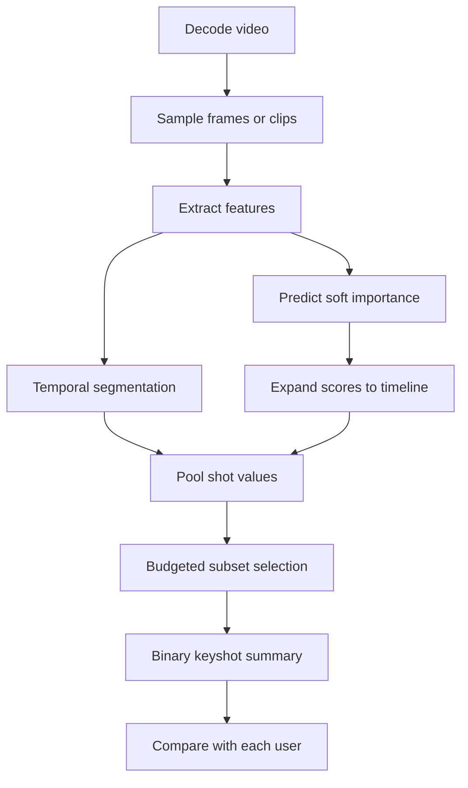

# Foundations and Architecture Blueprints

## 1. Scope: what counts as video summarization?

Video summarization compresses a video into selected visual content, generated text, or a coordinated multimodal summary. This handbook covers learned and training-free systems, with supervised approaches as a first-class part of the field. This chapter develops the extractive case; the [taxonomy](05-taxonomy.md) and [foundation-model chapter](10-foundation-models.md) extend it to textual and multimodal outputs.

Two output forms must be distinguished:

- A **storyboard** is an ordered set of keyframes. It has no inherent playback-duration budget unless one is defined separately.
- A **video skim** is an ordered set of keyshots whose total duration obeys a budget.

Abstractive video-to-text summarization is in scope. Highlight detection and trailer generation have different relevance or editorial targets; temporal localization and video question answering are adjacent tasks. Every result must name its target and evaluation unit.

### 1.1 Supervision labels

“Unsupervised” is frequently used too broadly. This repository uses the following labels:

| Label | Operational meaning |
|---|---|
| **Unsupervised** | No human importance scores or human summaries are used as the selector's training target. |
| **Self-supervised** | The learning signal is constructed from the video itself: masking, temporal-order prediction, augmentation pairs, predictive cycles used only as pretext tasks, and similar objectives. |
| **Training-free** | No parameters are fitted on the target summarization dataset. |
| **Zero-shot foundation model** | A pretrained VLM or Video-LLM is applied without task-specific fitting. Its upstream pretraining is not “unsupervised” by definition. |
| **Weak/external supervision** | Titles, captions, edited videos, web images, category labels, or unpaired summaries influence selection. |
| **Supervised** | Human importance, selections, or summary text train the predictor; this is a core regime. |
| **Semi-supervised** | Labeled and unlabeled target-domain examples jointly influence learning. |
| **Few-shot** | A small, explicitly counted set of labeled examples is used for adaptation or in-context conditioning. |

These categories can overlap. For example, a training-free CLIP ranker is also zero-shot, whereas a CLIP-based model tuned on human SumMe scores is supervised.

## 2. Common notation

Let a decoded video contain $`N`$ frames on its original timeline:

```math
V=(v_1,\ldots,v_N).
```

A sampling operator keeps the ordered indices

```math
P=(p_1,\ldots,p_T),\qquad 1\le p_1<\cdots<p_T\le N,
```

and an encoder produces

```math
x_t=E(v_{p_t})\in\mathbb{R}^{d},\qquad
X=[x_1,\ldots,x_T]^\top\in\mathbb{R}^{T\times d}.
```

The summarizer predicts soft importance

```math
s_t=f_\theta(X)_t,\qquad s_t\in[0,1].
```

Many reconstruction systems train with a differentiable gate

```math
\widetilde{x}_t=s_t x_t.
```

This is a weighted sequence, **not** a literal sparse subset. The hard summary is created later through thresholding or segment-level budget optimization.

| Symbol | Definition |
|---|---|
| $`N`$ | Decoded frame count on the original timeline |
| $`T`$ | Sampled frames or clips processed by the model |
| $`d`$ | Feature dimension |
| $`s_t`$ | Soft importance of sampled element $`t`$ |
| $`y_n\in\{0,1\}`$ | Final binary mask on original frame $`n`$ |
| $`C_j`$ | Temporal segment or shot $`j`$ |
| $`\ell_j=\lvert C_j\rvert`$ | Segment duration in original frames |
| $`u_j`$ | Pooled importance of segment $`C_j`$ |
| $`\beta`$ | Maximum summary fraction, commonly $`0.15`$ in SumMe/TVSum pipelines |
| $`B=\lfloor\beta N\rfloor`$ | Hard duration capacity in frames |

## 3. Four useful unsupervised system families

Classify a hybrid by the selector's dominant learning signal, then attach secondary tags such as `GAN`, `graph`, `audio`, `CLIP`, or `LLM`.

| Paradigm | Selector's dominant signal | Representative mechanisms | Principal failure mode |
|---|---|---|---|
| **1. Reconstruction & Generative** | Preserve enough information to reconstruct the input or match its feature distribution | AE/VAE, GAN, cycle consistency | Frequent/background content is easy to reconstruct; short salient events can vanish in an average loss |
| **2. DRL & Heuristic Scoring** | Maximize an explicit subset reward | Policy gradient, actor–critic, clustering, diversity/representativeness rewards | Reward design can encode an arbitrary answer and optimize a misaligned proxy |
| **3. Contrastive & Self-Supervised** | Solve a video-derived pretext objective | Temporal contrast, mutual-information bounds, masked prediction, inverse optimal transport | Positive/negative construction determines what “important” means |
| **4. Multimodal Foundation Models & Zero-Shot** | Reuse pretrained semantic alignment or prompted reasoning | CLIP scoring, audio–visual–text fusion, Video-LLM selection | Unknown pretraining contamination, prompt sensitivity, temporal aliasing, and inference cost |

Cycle consistency belongs to Paradigm 1 when the cycle reconstructs video or summary representations. A method does not move to Paradigm 3 merely because its reconstruction target needs no human label.

## 4. End-to-end summary construction



Every block is part of the evaluated system. Freezing the learned scores while changing segmentation or subset selection can change F1.

### 4.1 Kernel Temporal Segmentation

A common pipeline uses Kernel Temporal Segmentation (KTS), introduced by [Potapov et al., ECCV 2014](https://inria.hal.science/hal-01022967), to divide a feature sequence into coherent intervals.

Let $`T_{\mathrm{KTS}}`$ be the descriptor count supplied to KTS, which need not equal the $`N`$ decoded frames. For a positive-semidefinite kernel $`K`$, the within-segment scatter of half-open interval $`[a,b)`$ is

```math
v_{a,b}=\sum_{t=a}^{b-1}K_{tt}
-\frac{1}{b-a}
\sum_{i=a}^{b-1}\sum_{j=a}^{b-1}K_{ij}.
```

For $`m`$ segments with boundaries $`0=b_0<b_1<\cdots<b_m=T_{\mathrm{KTS}}`$, one fixed-order form is

```math
\min_{0=b_0<b_1<\cdots<b_m=T_{\mathrm{KTS}}}
\sum_{j=1}^{m}v_{b_{j-1},b_j}.
```

Model-order selection adds an explicit complexity penalty. The [evaluation chapter](02-evaluation.md#3-segmentation-is-part-of-the-benchmark) gives the canonical dynamic program, penalty convention, and zero-change-point edge case; implementations should not mix its “number of change points” symbol with the “number of segments” $`m`$ used in this overview.

KTS on 2-fps descriptors is not equivalent to KTS on every decoded frame. An implementation must record the input timeline, kernel and normalization, penalty or fixed change-point count, boundary convention, and sampled-to-original timestamp mapping. The [official CSTA repository](https://github.com/thswodnjs3/CSTA) documents a concrete correction from downsampled-only to full-timeline summary generation.

### 4.2 Expanding and pooling scores

After mapping sampled scores to the original timeline, mean-pooled shot importance is

```math
u_j=\frac{1}{\ell_j}\sum_{n\in C_j}\bar{s}_n.
```

A complete zero-order-hold expansion, including both endpoints, is

```math
\bar{s}_n=
\begin{cases}
s_1, & 1\le n<p_1,\\
s_t, & p_t\le n<p_{t+1},\quad t=1,\ldots,T-1,\\
s_T, & p_T\le n\le N.
\end{cases}
```

The first case is empty when $`p_1=1`$. Nearest-neighbor and linear interpolation are valid alternatives, but they are not numerically identical and therefore must be named.

### 4.3 Exact budgeted selection

Let $`z_j\in\{0,1\}`$ indicate whether shot $`C_j`$ is selected. Exact 0/1 knapsack solves

```math
\max_{z_1,\ldots,z_m}\sum_{j=1}^{m}q_jz_j
\quad\text{subject to}\quad
\sum_{j=1}^{m}\ell_jz_j\le B.
```

Two value definitions are common and must not be conflated:

```math
q_j=u_j
\qquad\text{versus}\qquad
q_j=\ell_ju_j.
```

Mean importance as total item value favors short shots under a duration cost; duration-weighted importance integrates frame utility over time. Solver, integer capacity, rounding, and tie-breaking also affect the selected set.

The final frame mask is

```math
y_n=\sum_{j=1}^{m}z_j\mathbf{1}[n\in C_j].
```

[SUM-GAN](https://openaccess.thecvf.com/content_cvpr_2017/html/Mahasseni_Unsupervised_Video_Summarization_CVPR_2017_paper.html) uses a related segment-score/ranking decoder under a 15% limit; the paper does not clearly specify the later KTS-plus-exact-knapsack convention. Many descendants do use KTS, pooling, and knapsack, so every result should record the decoder actually used. [Otani et al., CVPR 2019](https://openaccess.thecvf.com/content_CVPR_2019/html/Otani_Rethinking_the_Evaluation_of_Video_Summaries_CVPR_2019_paper.html) show why this post-processing cannot be treated as incidental.

## 5. Objective-function toolkit

These are repository-level canonical abstractions, unless a paper equation is explicitly identified. They are not attributed verbatim to every method using a similar mechanism. The [reconstruction chapter](04-reconstruction-generative.md) identifies the exact subset used by each method.

### 5.1 Representativeness and reconstruction

Direct feature reconstruction:

```math
\mathcal{L}_{\mathrm{rec}}
=\frac{1}{T}\sum_{t=1}^{T}\|x_t-\widehat{x}_t\|_2^2.
```

Nearest-selected-element coverage uses a binary selector $`a_i`$ on the sampled feature timeline. With $`A=\{i:a_i=1\}`$,

```math
\mathcal{L}_{\mathrm{repr}}
=\frac{1}{T}\sum_{t=1}^{T}\min_{i\in A}\|x_t-x_i\|_2^2,
\qquad
R_{\mathrm{repr}}=\exp(-\mathcal{L}_{\mathrm{repr}}).
```

Require $`|A|\ge1`$; equivalently define $`\mathcal L_{\mathrm{repr}}=+\infty`$ for an empty selected set. The objective lives on sampled features, whereas $`y_n`$ is the later binary mask on the original frame timeline. It is a feature-space facility-location objective, not a semantic importance oracle. Long repetitive scenes contribute many terms and can dominate brief events.

### 5.2 Cosine diversity

A score-weighted redundancy penalty is

```math
\mathcal{L}_{\mathrm{cos}}=\frac{
\sum_{i\ne j}s_is_j\dfrac{x_i^\top x_j}{\|x_i\|_2\|x_j\|_2}
}{
\sum_{i\ne j}s_is_j+\varepsilon
}.
```

Minimizing it discourages similar selections. An equivalent reward can average cosine distance $`1-\cos(x_i,x_j)`$. Either form can prefer visual outliers, so it should be paired with coverage or reconstruction.

### 5.3 Determinantal point processes

Let $`r_i=h_i/\|h_i\|_2`$ be normalized embeddings, collect their rows in $`R`$, and define the positive-semidefinite Gram kernel

```math
S=RR^\top,
\qquad S_{ij}=r_i^\top r_j.
```

For nonnegative quality $`q_i`$, define

```math
L=\mathrm{diag}(q)S\mathrm{diag}(q).
```

For subset $`Y`$, an L-ensemble DPP defines

```math
P(Y;L)=\frac{\det(L_Y)}{\det(L+I)},
```

so the negative log-likelihood is

```math
\mathcal{L}_{\mathrm{DPP}}
=-\log\det(L_Y)+\log\det(L+I).
```

The determinant rewards the feature-space volume spanned by high-quality selections. Numerically, use Cholesky or `slogdet`, add documented diagonal jitter, and reject non-PSD kernels. A dense frame-level determinant costs $`O(T^3)`$. See [Kulesza and Taskar's DPP monograph](https://arxiv.org/abs/1207.6083).

### 5.4 Soft sparsity and hard budget

The common training-time length penalty is

```math
\mathcal{L}_{\mathrm{len}}
=\left(\frac{1}{T}\sum_{t=1}^{T}s_t-\sigma\right)^2.
```

It controls only mean soft mass. It neither produces a binary subset nor guarantees the inference-time duration budget.

The hard inference constraint is

```math
\sum_j\ell_jz_j\le\lfloor\beta N\rfloor,
\qquad z_j\in\{0,1\}.
```

Training $`\sigma`$ and inference $`\beta`$ can differ; Cycle-SUM, for example, reports $`\sigma=0.30`$ during training and a 15% final summary limit.

### 5.5 Cycle consistency

For forward map $`G_f:S\rightarrow O`$ and backward map $`G_b:O\rightarrow S`$,

```math
\mathcal{L}_{\mathrm{cyc}}=\frac{1}{|S|}\|G_b(G_f(S))-S\|_1
+
\frac{1}{|O|}\|G_f(G_b(O))-O\|_1.
```

Cycle consistency reduces unconstrained domain mappings. It does not prove semantic faithfulness: two generators can hide information in representations that satisfy a cycle without producing a human-preferred summary.

### 5.6 Multimodal alignment and calibration

For L2-normalized visual embedding $`\bar v_t`$ and text/query embedding $`\bar q`$, a temperature-scaled alignment logit is

```math
a_t=\frac{\bar v_t^\top\bar q}{\tau}.
```

If visual, audio, and transcript branches have scores on different scales, direct addition is ill-defined. One explicit per-video calibration is

```math
\widetilde a_t^{(m)}=
\frac{a_t^{(m)}-\mu_m}{\sigma_m+\varepsilon},
\qquad
s_t=\mathrm{sigmoid}\!\left(b+\sum_m w_m\widetilde a_t^{(m)}\right),
```

where $`m`$ indexes modalities and $`\mathrm{sigmoid}(\cdot)`$ is the logistic function. A method must state whether $`w_m`$, temperature, and prompt were fixed, fitted without summary labels, or tuned on the benchmark; these choices change its supervision category.

## 6. Feature semantics and provenance

| Feature family | Temporal unit | Emphasis | Reproduction-critical fields |
|---|---|---|---|
| [GoogLeNet pool5](https://arxiv.org/abs/1409.4842) | Frame | Static appearance | ImageNet checkpoint, resize/crop, layer, 1024-D output, commonly 2-fps sampling |
| ResNet-101 pooled | Frame | Static appearance | Checkpoint, 2048-D pooling, preprocessing, sampling |
| [I3D](https://openaccess.thecvf.com/content_cvpr_2017/html/Carreira_Quo_Vadis_Action_CVPR_2017_paper.html) | Clip | Short-term action and motion | Clip length/stride, RGB or flow stream, endpoint, temporal center |
| [CLIP ViT](https://proceedings.mlr.press/v139/radford21a.html) | Frame or image batch | Image–text semantics | Exact checkpoint, crop, token versus pooled output, L2 normalization |
| [VideoMAE](https://proceedings.neurips.cc/paper_files/paper/2022/hash/416f9cb3276121c42eebb86352a4354a-Abstract-Conference.html) | Clip | Spatiotemporal structure | Checkpoint, tubelet size, frames per clip, stride, pooling rule |

A frame tensor and a clip tensor have different receptive fields and timestamp semantics. Replacing only the feature filename while retaining old KTS boundaries is not a controlled backbone ablation.

Pre-extracted HDF5 packages often colocate:

```text
features
gtscore
gtsummary
user_summary
change_points
n_frame_per_seg
n_frames
picks
video_name
```

The schema is documented by the [official SUM-GAN-AAE implementation](https://github.com/e-apostolidis/SUM-GAN-AAE). Co-location is not itself leakage, but an unsupervised loader must demonstrate that human-derived fields are never used for training, checkpoint selection, early stopping, or hyperparameter choice.

Every released tensor bundle should state raw-video hashes; decoder and frame-rate handling; sampled indices and timestamps; architecture, checkpoint, layer, normalization, dimension, and dtype; clip window and stride; PCA or L2 normalization; KTS inputs and parameters; split identifiers; seeds; and checkpoint-selection rules.

## 7. Cross-cutting implementation bottlenecks

- **Selector collapse:** Reconstruction improves by retaining everything; a mean-length penalty still admits nearly flat scores.
- **Soft/hard mismatch:** Training optimizes weighted features, while inference uses nondifferentiable segmentation and subset selection.
- **Long-sequence cost:** recurrent decoding is sequential; dense attention/DPP kernels need $`O(T^2)`$ memory and dense determinants need $`O(T^3)`$ work.
- **Temporal alignment:** sampled timestamps, padded batches, reversed decoders, full-frame masks, and user annotations must share a declared time base.
- **Feature dominance:** a frozen encoder can determine similarity more strongly than the selector; backbone changes define a new experimental condition.
- **Semantic blind spots:** feature fidelity and event frequency are not narrative importance.
- **Post-processing dominance:** KTS boundaries, shot-value pooling, capacity rounding, and tie-breaking can change F1 without changing learned scores.
