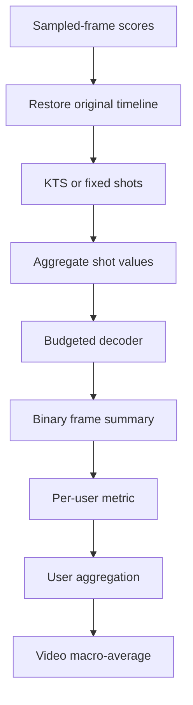

# Evaluation Protocols and Failure Modes

## 1. The metric is a pipeline

A reported “F1” is not reproducible unless its score-to-summary decoder is specified.

Changing any intermediate step can change the final value while leaving model parameters and predicted scores untouched.

## 2. Temporal-overlap F1

For machine summary $y\in\{0,1\}^{N}$ and user $u$'s reference $g^{(u)}\in\{0,1\}^{N}$, aligned to the original $N$-frame timeline, define

$$
O_u=\sum_{t=1}^{N}y_tg_t^{(u)},\qquad
L_y=\sum_ty_t,\qquad
L_u=\sum_tg_t^{(u)}.
$$

When the corresponding denominator is nonzero,

$$
P_u=\frac{O_u}{L_y},\qquad
R_u=\frac{O_u}{L_u},\qquad
F_{1,u}=\frac{2P_uR_u}{P_u+R_u}
=\frac{2O_u}{L_y+L_u}.
$$

Equivalently, define $F_{1,u}=2O_u/(L_y+L_u)$ whenever $L_y+L_u>0$. If both masks are empty, this handbook records $F_1=0$; implementations must disclose a different convention. Precision or recall remains individually undefined when its own denominator is zero. The public SumMe evaluator and DR-DSN map zero-overlap/undefined cases to zero. This is a **temporal-overlap** score. It does not measure semantic equivalence, story coherence, aesthetics, causal coverage, or diversity. See [Otani et al., CVPR 2019, Section 3.3](https://arxiv.org/html/1903.11328v2#S3.SS3) and [Zhang et al., ECCV 2016](https://www.cs.utexas.edu/~grauman/papers/zhang-eccv2016-lstm-summ.pdf).

For $U_v$ references of video $v$, two incompatible aggregations are

$$
F_v^{\mathrm{mean}}=\frac{1}{U_v}\sum_{u=1}^{U_v}F_{1,u},
\qquad
F_v^{\mathrm{max}}=\max_uF_{1,u}.
$$

The dataset score is normally a macro-average over test videos:

$$
F_{\mathcal D}=\frac{1}{|\mathcal V_{\mathrm{test}}|}
\sum_{v\in\mathcal V_{\mathrm{test}}}F_v,
$$

not a micro-F1 after concatenating every video.

### 2.1 Original protocols versus later convention

| Dataset | Original source protocol | Common post-2016 deep-learning convention |
|---|---|---|
| **SumMe** | Mean pairwise frame-overlap F1. Human leave-one-out uses $\bar F_i=(U-1)^{-1}\sum_{j\ne i}F_1(g^{(i)},g^{(j)})$; machine summaries are compared with all users and averaged. Human summaries were constrained to 5–15%, and machine summaries are usually capped at 15%. [Gygli et al., ECCV 2014](https://link.springer.com/content/pdf/10.1007/978-3-319-10584-0_33.pdf); [public evaluator copy in Zhang et al.'s repository](https://github.com/kezhang-cs/Video-Summarization-with-LSTM/blob/master/codes/evalSumMe/summe_evaluateSummary.m). | **Maximum** F1 across users, then mean across test videos. Zhang's evaluator computes both but its main wrapper reports the max column; DR-DSN explicitly selects `max` for SumMe. [Zhang code](https://github.com/kezhang-cs/Video-Summarization-with-LSTM/blob/master/codes/dppLSTM_eval.m); [DR-DSN code](https://github.com/KaiyangZhou/pytorch-vsumm-reinforce/blob/master/main.py). |
| **TVSum** | Average pairwise $F_\beta$, with $\beta=1$. The official script decodes one binary reference per annotator from fixed 60-frame units with capacity `fix(0.15*N)`, then averages 20 machine–reference F1 values. Whole-shot selection can underfill that capacity. [Song et al., CVPR 2015](https://people.csail.mit.edu/yalesong/publications/SongVSJ2015CVPR.pdf); [official evaluator](https://github.com/yalesong/tvsum/blob/master/matlab/script_evaluate_result.m). | Still **mean** across users, but each user reference is commonly re-decoded on the same precomputed KTS boundaries as the machine summary. [Zhang supplement](https://www.cs.utexas.edu/~grauman/papers/zhang-eccv2016-lstm-summ-supp.pdf); [later evaluator](https://github.com/kezhang-cs/Video-Summarization-with-LSTM/blob/master/codes/evalTVSum/evaluate_TVSum.m); [DR-DSN code](https://github.com/KaiyangZhou/pytorch-vsumm-reinforce/blob/master/main.py). |

Thus “SumMe = max, TVSum = mean” is a widespread later convention, **not the original official SumMe protocol**. Max aggregation is optimistic, is sensitive to reference count, and rewards matching any one annotator; mean aggregation rewards population agreement. They require separate columns.

## 3. Segmentation is part of the benchmark

KTS is a kernelized change-point detector, not a summary selector. Let $T_{\mathrm{KTS}}$ be the number of descriptors supplied to KTS—not necessarily the $N$ original decoded frames. For descriptor $x_t$, feature map $\phi$, kernel $K_{st}=\langle\phi(x_s),\phi(x_t)\rangle$, and half-open interval $[a,b)$,

$$
\mu_{a:b}=\frac{1}{b-a}\sum_{t=a}^{b-1}\phi(x_t),
$$

$$
v_{a,b}
=\sum_{t=a}^{b-1}\|\phi(x_t)-\mu_{a:b}\|_{\mathcal H}^{2}
=\sum_{t=a}^{b-1}K_{tt}
-\frac{1}{b-a}\sum_{s=a}^{b-1}\sum_{t=a}^{b-1}K_{st}.
$$

One dynamic program is

$$
L_{i,j}=\min_{t=i,\ldots,j-1}\left(L_{i-1,t}+v_{t,j}\right),
\qquad L_{0,j}=v_{0,j},
$$

followed by model-order selection such as

$$
m^\star=\arg\min_{1\le m\le m_{\max}}
\left[L_{m,T_{\mathrm{KTS}}}
+Cm\left(\log\frac{T_{\mathrm{KTS}}}{m}+1\right)\right].
$$

Here $m$ denotes the number of change points, yielding $m+1$ segments. The zero-change-point case must be compared separately using $L_{0,T_{\mathrm{KTS}}}$, or the penalty must explicitly define its continuous-extension value at $m=0$; the printed logarithmic expression is otherwise undefined there. This half-open convention is equivalent to the inclusive indexing used in the foundations overview once endpoints are shifted consistently.

The standard dense implementation costs $O(m_{\max}T_{\mathrm{KTS}}^2)$ time and ordinarily $O(T_{\mathrm{KTS}}^2)$ kernel/scatter storage. The original system sampled every fifth frame and used 16,512-dimensional SIFT Fisher vectors; modern CNN or CLIP features yield different boundaries. Reuse a named released boundary file or report sampling rate, descriptor, kernel, penalty, and maximum number of change points. See [Potapov et al., ECCV 2014](https://link.springer.com/content/pdf/10.1007/978-3-319-10599-4_35.pdf).

The original Potapov summary builder ranked segments and cropped its last chosen segment; it did **not** define the later KTS-plus-knapsack convention.

## 4. From scores to a 15% keyshot skim

For shots $S_j$, lengths $\ell_j=|S_j|$, and frame scores $s_t$, many implementations use

$$
v_j^{\mathrm{mean}}=\frac{1}{\ell_j}\sum_{t\in S_j}s_t,
\qquad
B=\lfloor0.15N\rfloor,
$$

then solve

$$
\max_{z\in\{0,1\}^{M}}\sum_{j=1}^{M}v_jz_j
\quad\text{subject to}\quad
\sum_{j=1}^{M}\ell_jz_j\le B.
$$

An integer-capacity dynamic program returns the exact optimum of this stated 0/1 problem in $O(MB)$, despite some papers calling it “near-optimal.” A recurrence is

$$
D(i,b)=
\begin{cases}
D(i-1,b), & \ell_i>b,\\[2mm]
\max\{D(i-1,b),\ D(i-1,b-\ell_i)+v_i\}, & \ell_i\le b.
\end{cases}
$$

Base cases are $D(0,b)=0$ and $D(i,0)=0$. Equal-value branches still need a deterministic traceback rule if bitwise reproducibility matters.

The [DR-DSN implementation](https://github.com/KaiyangZhou/pytorch-vsumm-reinforce/blob/master/vsum_tools.py) mean-pools shots, sets $B=\lfloor0.15N\rfloor$, and calls an [exact dynamic-programming solver](https://github.com/KaiyangZhou/pytorch-vsumm-reinforce/blob/master/knapsack.py).

The official TVSum solver has a separate pathological edge case: if DP returns an all-zero mask, it falls back first to a frame-score quantile threshold and then to sorted individual frames. That fallback abandons shot integrity and must be disclosed if it is triggered; see [`solve_knapsack.m`](https://github.com/yalesong/tvsum/blob/master/matlab/solve_knapsack.m).

### 4.1 Exact DP, greedy, and thresholding are different algorithms

| Decoder | Actual operation | Why results differ |
|---|---|---|
| **0/1 knapsack DP** | Globally maximizes the declared shot-value objective under an integer budget. | Capacity rounding, boundary inclusivity, floating ties, and traceback rules still matter. |
| **Rank-greedy** | Sorts by raw value $v_j$, or sometimes density $v_j/\ell_j$, then adds a shot if it fits. | Neither sort is generally equivalent to 0/1 knapsack. DR-DSN's optional `rank` path sorts raw values and uses strict `< B`, rejecting an exact fill. |
| **Threshold** | Keeps frames/shots satisfying $s_t\ge\theta$. | A fixed threshold does not enforce fixed duration; snapping frames to complete shots changes duration again. |
| **Top-$B$ frames** | Keeps exactly the highest-scoring frames. | It respects a frame count but discards shot integrity and evaluates a different output object. |

A minimal counterexample shows the decoder gap. With shot lengths $(6,5,5)$, values $(9,8,8)$, and capacity $10$, raw-value greedy selects only the first shot for value $9$; exact DP selects the two five-frame shots for value $16$.

Also distinguish mean from duration-weighted value:

$$
v_j^{\mathrm{sum}}=\sum_{t\in S_j}s_t=\ell_jv_j^{\mathrm{mean}}.
$$

These define different optimization problems. Mean as an item's total value charges long shots more capacity without granting value proportional to duration, structurally favoring short shots.

## 5. Why overlap F1 can reward trivial scores

[Otani et al.](https://openaccess.thecvf.com/content_CVPR_2019/papers/Otani_Rethinking_the_Evaluation_of_Video_Summaries_CVPR_2019_paper.pdf) showed that variable-length segmentation plus mean-valued knapsack can dominate the final F1:

- Mean shot values remain on the same scale regardless of duration, while duration is charged as weight. Combinations of short shots frequently dominate long shots.
- KTS tends to create long segments in visually stable regions. Knapsack then rejects many long segments, incidentally applying a plausible nonredundancy prior even when importance scores are random.
- Across 100 trials per random setting, independent $U[0,1]$ frame scores with KTS obtained $0.19/0.41$ mean/max F1 on SumMe and $0.57/0.78$ on TVSum. Corresponding human KTS leave-one-out values were $0.31/0.54$ and $0.54/0.78$. These Table 1 diagnostics describe that exact pipeline; they are not universal random-baseline constants.
- Summing rather than averaging frame scores made human annotations more distinguishable from random scores, although segmentation effects remained.
- In Otani et al.'s supplementary TVSum experiment, with 10 generated summaries per setting, F1 tended to rise as the duration constraint increased from 15% to 25% to 35%; results across budgets are therefore incomparable.

A frame-wise sanity check explains nonzero chance overlap. If prediction and reference independently select fraction $q$ of frames, then $\mathbb{E}[O]\approx q^2N$ and $\mathbb{E}[F_1]\approx q$. At a 15% budget, roughly 0.15 is already chance-scale F1 under this simplified model.

“Random scores,” “equal-length segmentation,” and “uniform temporal sampling” are distinct baselines. Otani's strongest artifact involved random scores with KTS or bimodal shot lengths; it is inaccurate to claim broadly that uniform segmentation always beats learned methods.

## 6. Rank correlation evaluates scores before decoding

Let $R_t=\operatorname{rank}(s_t)$ and $Q_t^{(u)}=\operatorname{rank}(h_t^{(u)})$, using average ranks for ties.

Spearman's $\rho$ is the Pearson correlation of ranks:

$$
\rho_u=
\frac{\sum_t(R_t-\bar R)(Q_t^{(u)}-\bar Q_u)}
{\sqrt{\sum_t(R_t-\bar R)^2}\sqrt{\sum_t(Q_t^{(u)}-\bar Q_u)^2}}.
$$

The shortcut $1-6\sum d_t^2/[N(N^2-1)]$ assumes no ties and is therefore a poor specification for discrete TVSum ratings.

Tie-aware Kendall $\tau_b$ is

$$
\tau_b=\frac{C-D}
{\sqrt{(C+D+T_R)(C+D+T_Q)}},
$$

where $C,D$ count concordant/discordant pairs and $T_R,T_Q$ count pairs tied only in one ranking. Otani's released environment used SciPy's tie-aware implementation; see the [official analysis notebook](https://github.com/mayu-ot/rethinking-evs/blob/master/notebooks/rank%20order%20statistics.ipynb).

Compute $\tau_b$ and $\rho$ against each annotator, average annotators within a video, then macro-average videos. Otani reported on TVSum:

| Score sequence | Kendall $\tau$ | Spearman $\rho$ |
|---|---:|---:|
| dppLSTM | 0.042 | 0.055 |
| DR-DSN | 0.020 | 0.026 |
| Random | 0.000 | 0.000 |
| Human leave-one-out | 0.177 | 0.204 |

Rank statistics remove KTS and knapsack from the measurement and have zero expectation for random rankings. They are invariant to strictly increasing recalibration—or any transform preserving order and ties—apply only to systems producing dense scores, and still do not measure the coherence or watchability of the assembled skim.

## 7. Terminology correction: temporal F1 versus “C-F1”

> **Terminology rule (audit cut: 2026-09-06):** **C-F1 is ambiguous and is not part of the canonical SumMe/TVSum protocol.** No primary source found in this audit defines it as a universal “coverage-based F1.” Use the name only with a paper-specific equation and citation.

Nearby but non-equivalent terms are:

- **Content F1 / C-F1** in [Palaskar et al., 2019](https://arxiv.org/pdf/1906.07901), for textual How2 summaries: words are aligned with METEOR, function/task stop words are removed, and F1 is computed over remaining aligned content words.
- **FCLIP** and **Cross-FCLIP** in [V2Xum-LLM](https://arxiv.org/abs/2404.12353), cross-modal semantic metrics rather than C-F1.
- Importance, mega-event continuity, and similarity/time/concept diversity in [VISIOCITY](https://arxiv.org/abs/2007.14560), a multi-measure framework rather than a metric named coverage-F1.

Accordingly, this handbook compares **temporal-overlap F1 with explicitly defined semantic or concept-coverage measures**. It never infers a metric from the acronym alone.

### 7.1 V2Xum-LLM's clipped $F_{\mathrm{CLIP}}$

[V2Xum-LLM](https://arxiv.org/html/2404.12353v3#Sx6.SS2) evaluates predicted keyframes $P$ against reference frames $G$ using CLIP ViT-L/14@336 and clips negative similarities:

$$
\kappa(a,b)=\max\{0,\cos(e_a,e_b)\}.
$$

Its set-matching precision and recall are

$$
P_{\mathrm{CLIP}}=
\frac{1}{|P|}\sum_{p\in P}\max_{g\in G}\kappa(p,g),
\qquad
R_{\mathrm{CLIP}}=
\frac{1}{|G|}\sum_{g\in G}\max_{p\in P}\kappa(g,p),
$$

$$
F_{\mathrm{CLIP}}=
\frac{2P_{\mathrm{CLIP}}R_{\mathrm{CLIP}}}
{P_{\mathrm{CLIP}}+R_{\mathrm{CLIP}}}.
$$

This credits semantic similarity without exact temporal overlap. It also permits many-to-one nearest matches, and its value depends on the exact encoder, preprocessing, and clipping rule; it is not interchangeable with temporal-overlap F1 or a metric called C-F1.

The equations assume nonempty $P$ and $G$ and a nonzero harmonic-mean denominator. A reusable implementation must define empty-set behavior explicitly.

## 8. Protocol divergence matrix

| Choice | Variant A | Variant B | Consequence |
|---|---|---|---|
| User aggregation | SumMe max | SumMe mean | Max can be substantially higher and rewards any matching annotator |
| Reference construction | Original dataset units | Shared KTS shots | Changes ground truth before scoring |
| Shot value | Mean score | Duration-weighted sum | Mean structurally favors short segments |
| Decoder | Exact 0/1 DP | Greedy/threshold | Produces a different subset at the same nominal budget |
| Timeline | Sampled frames | Original decoded frames | Off-by-one and interpolation choices change overlap |
| Budget | 15% | Other fraction | F1 changes mechanically with allowed duration |
| Split | No original split; five later released/random 80/20 splits | Augmented/transfer | Training exposure and test composition differ |
| Run reporting | Best checkpoint/seed | Mean over fixed seeds | Best-run reporting is optimistic |

One audit warning: Zhang's released path first constructs a machine summary under a 15% budget, then its [TVSum evaluator](https://github.com/kezhang-cs/Video-Summarization-with-LSTM/blob/master/codes/evalTVSum/evaluate_TVSum.m) uses an unexplained `budget=0.18` while decoding user references on shared `pred_seg` boundaries. The resulting comparison can therefore pair a ≤15% machine summary with 18%-budget references, even though the paper and supplement specify 15%. Treat 0.18 as a code discrepancy, not a normative protocol.

## 9. Minimum reproducibility checklist

Every result row must disclose:

1. temporal sampling and mapping back to original frames;
2. segmentation method, KTS feature/settings, or exact released change-point file;
3. inclusive `[start, end]` versus half-open `[start, end)` boundaries;
4. mean, sum, max, or learned shot aggregation;
5. exact DP, raw-value greedy, density greedy, threshold, or top-$B$ decoding;
6. budget, rounding, exact-fill inequality, and tie-breaking;
7. TVSum reference construction and whether references share machine boundaries;
8. per-user mean or max and per-video macro aggregation;
9. folds, seeds, repeated runs, uncertainty, and checkpoint rule;
10. random-score, uniform-sampling, and human leave-one-out baselines.
