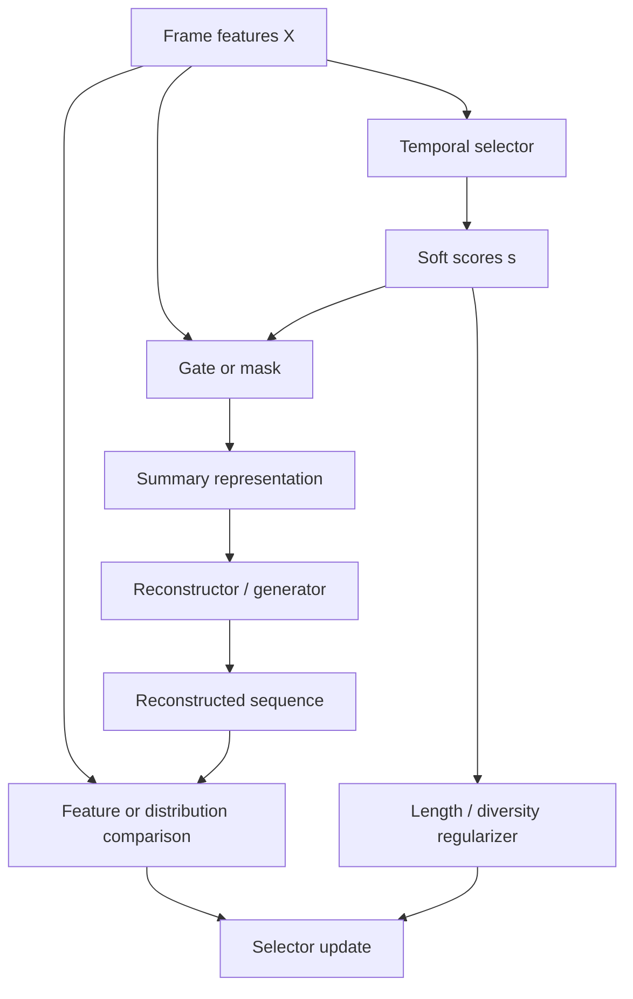
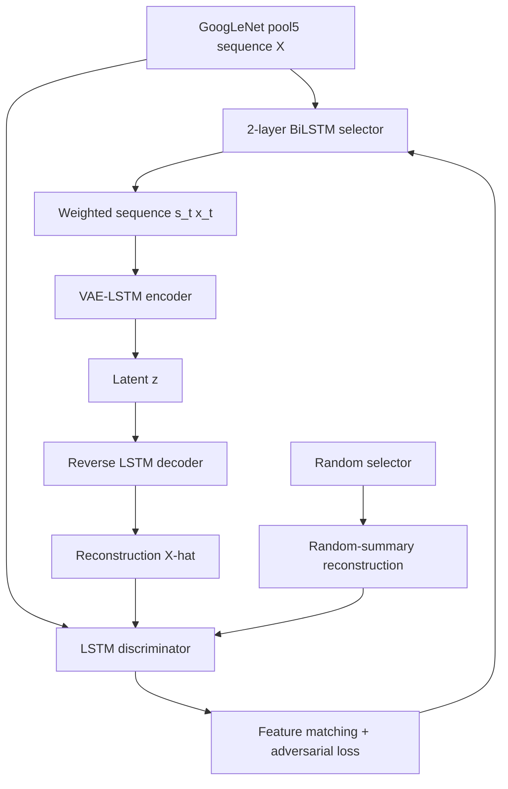
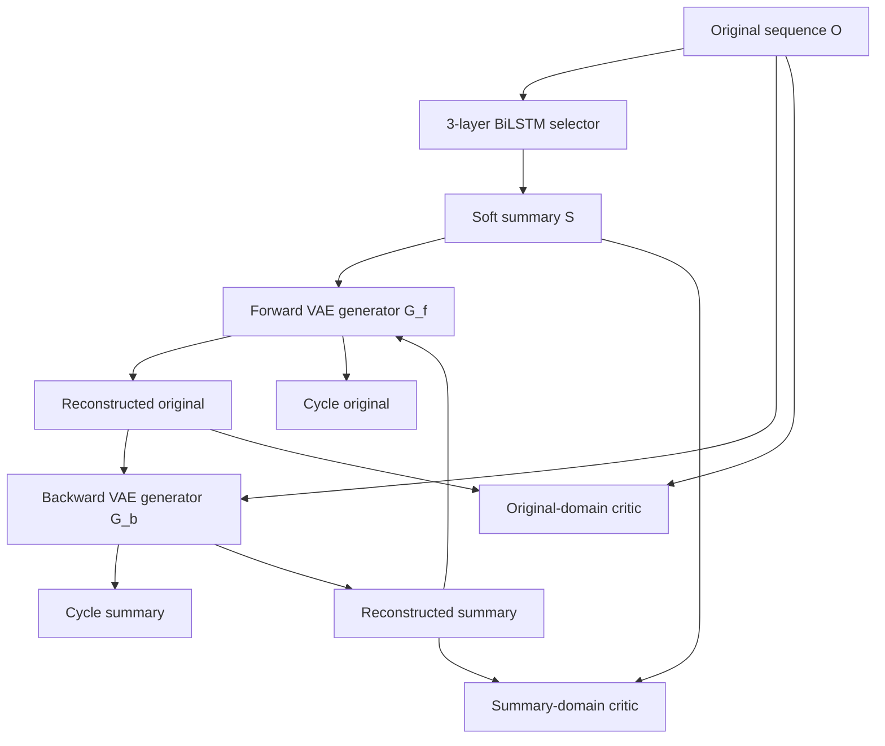
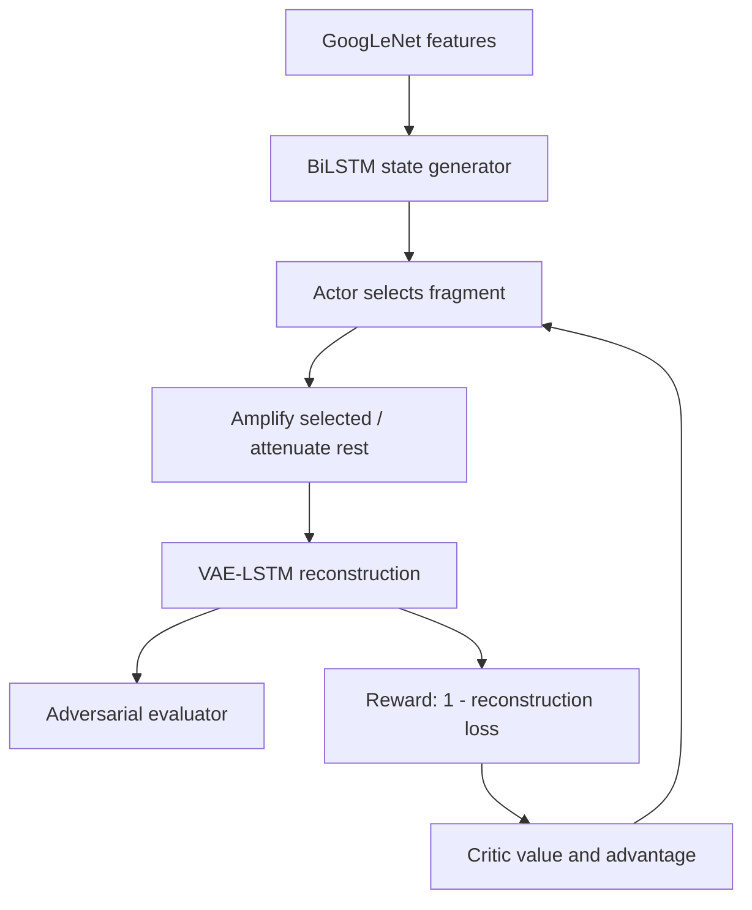
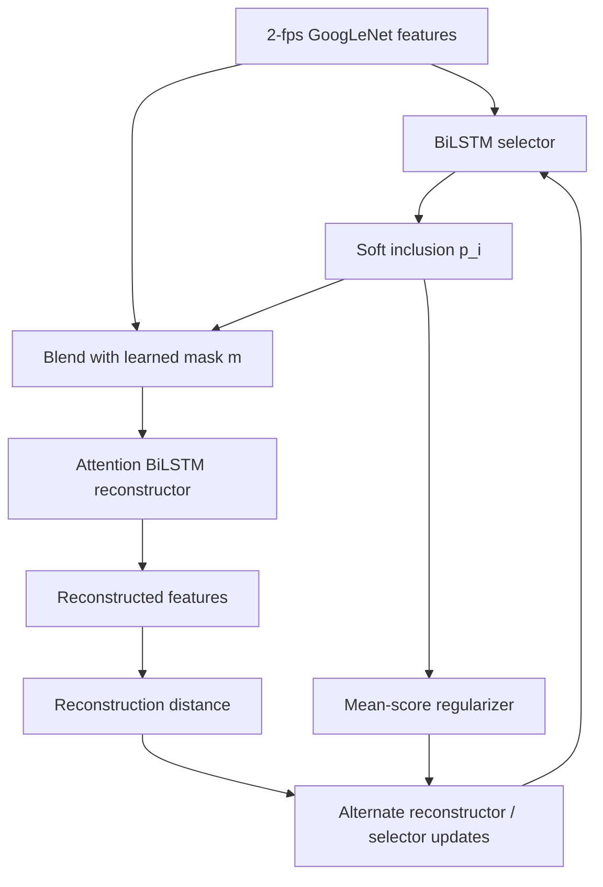

# Reconstruction and Generative Approaches

## 1. Core hypothesis and limits

This family assumes that a useful summary preserves enough information to reconstruct the source feature sequence or to make a generated sequence indistinguishable from it.

A generic objective is

$$
\mathcal L=
\lambda_{\mathrm{rec}}\mathcal L_{\mathrm{rec}}
+\beta_{\mathrm{KL}}\mathcal L_{\mathrm{prior}}
+\lambda_{\mathrm{adv}}\mathcal L_{\mathrm{adv}}
+\lambda_{\mathrm{cyc}}\mathcal L_{\mathrm{cyc}}
+\lambda_{\mathrm{len}}\mathcal L_{\mathrm{len}}
+\lambda_{\mathrm{div}}\mathcal L_{\mathrm{div}}.
$$

No individual paper uses every term. Reconstruction is a representation-coverage proxy, not semantic importance: frequent or visually stable content can dominate average error, while a brief causal event contributes little.

## 2. Protocol-separated result ledger

These values are copied from primary papers. A dash in the rank columns means the paper did not report Kendall $\tau$ or Spearman $\rho$.

### 2.1 Single synthesized-reference protocol

| Method | Supervision | SumMe F1 | TVSum F1 | $\tau/\rho$ | Source/protocol note |
|---|---|---:|---:|---:|---|
| SUM-GAN | Unsupervised | 38.7 | 50.8 | — | Five random splits; one synthesized reference summary |
| SUM-GAN-rep | Unsupervised | 38.5 | 51.9 | — | Repelling regularizer |
| SUM-GAN-dpp | Unsupervised | 39.1 | 51.7 | — | DPP regularizer |
| SUM-GAN-sup | **Supervised** | 41.7 | 56.3 | — | Human-score loss; comparator only |
| Cycle-SUM | Unsupervised | 41.9 | 57.6 | — | Five random runs; synthesized-reference protocol |

SUM-GAN's augmented setting reports 41.7/58.9 for the base model, 42.5/59.3 for repelling, 43.4/59.5 for DPP, and 43.6/61.2 for the supervised variant. The three unsupervised variants train with SumMe, TVSum, OVP, and YouTube together; the supervised variant instead uses only the target dataset's 80% training partition. These are **not** canonical single-dataset results.

### 2.2 Multi-user temporal-overlap protocol

| Method | Setting | User aggregation | SumMe F1 | TVSum F1 | $\tau/\rho$ | Comparability warning |
|---|---|---|---:|---:|---:|---|
| ACGAN | Five-fold CV | SumMe max / TVSum mean | 46.0 | 58.5 | — | Hard top-$k$ conditional selector |
| SUM-GAN-sl | Paper: five-fold CV; released JSONs: overlapping random 80/20 splits | SumMe max / TVSum mean | 47.3 | 58.0 | — | Protocol/code conflict; AC-SUM-GAN later retables it as 47.8/58.4 |
| SUM-GAN-VAAE | Five random 80/20 splits | SumMe max / TVSum mean | 45.7 | 57.6 | — | Stochastic latent plus attention |
| SUM-GAN-AAE | Five random 80/20 splits | SumMe max / TVSum mean | 48.9 | 58.3 | — | Comparison-table pair is internally inconsistent with the paper's fixed-$\sigma$ prose and sweep |
| CSNet | Five non-overlapping 80/20 folds | SumMe max / TVSum mean | 51.3 | 58.8 | — | Fold construction differs from independently redrawn splits |
| GL-RPE (CSNet backbone) | Canonical; split construction not restated | SumMe max / TVSum mean | 50.2 | 59.1 | TVSum .070/.091 | A later CAAN table labels it 5FCV; rank values use raw scores |
| SUM-FCN_unsup | Multiple random 80/20 splits | SumMe max / TVSum mean | 41.5 | 52.7 | — | Source does not state the number of random splits |
| CAAN | Five-fold CV | SumMe max / TVSum mean | 50.8 | 59.6 | TVSum .062/.090 | Journal table rounds 50.81/59.58 to one decimal |
| UnpairedVSN | Augmented unpaired pool | SumMe max / TVSum mean | 47.5 | 55.6 | — | Uses human/professional summary-domain examples; weak/external supervision |
| AC-SUM-GAN | Five random 80/20 splits | SumMe max / TVSum mean | 50.8 | 60.6 | — | Actor–critic/GAN hybrid; synthesized-reference results are higher |
| SUM-SR-5iter | Five random 80/20 splits, five seeds | SumMe max / TVSum mean | 51.26 | 60.2 | — | Unsupervised model selection; its retested baseline numbers differ from original papers |

The [evaluation chapter](02-evaluation.md) explains why these tables remain protocol groups rather than a single rank ordering.

## 3. SUM-GAN

### Unsupervised Video Summarization with Adversarial LSTM Networks

**Behrooz Mahasseni, Michael Lam, and Sinisa Todorovic. CVPR 2017, pp. 202–211.** [CVF paper](https://openaccess.thecvf.com/content_cvpr_2017/papers/Mahasseni_Unsupervised_Video_Summarization_CVPR_2017_paper.pdf) · [author PDF](https://web.engr.oregonstate.edu/~sinisa/research/publications/cvpr17_summarization.pdf) · [DOI](https://doi.org/10.1109/CVPR.2017.318)

### 3.1 Architecture

- **Input:** ImageNet GoogLeNet `pool5`, 1,024-D per sampled frame.
- **Selector:** two-layer BiLSTM with 1,024 hidden units, then scalar sigmoid importance.
- **Reconstructor:** separate two-layer VAE encoder/decoder LSTMs with 2,048 hidden units; sequence is decoded in reverse.
- **Discriminator:** two-layer, 1,024-unit LSTM.
- **Extra negative:** a random selector creates $\widehat X^p$, intended to prevent an easy real/fake shortcut.

Let $s_t\in[0,1]$, $\widetilde x_t=s_tx_t$, latent encoding $e$, and $\widehat X=G(E(\widetilde X))$. In the paper's notation, the VAE prior is

$$
\mathcal L_{\mathrm{prior}}=
D_{\mathrm{KL}}\!\left(q(e\mid X)\,\|\,p_e(e)\right).
$$

Rather than matching individual frames directly, the paper reconstructs in discriminator feature space:

$$
\mathcal L_{\mathrm{recon}}
=\mathbb E[-\log p(\phi(X)\mid e)]
\propto
\|\phi(X)-\phi(\widehat X)\|_2^2.
$$

The augmented adversarial objective is

$$
\mathcal L_{\mathrm{GAN}}
=\log D(X)
+\log(1-D(\widehat X))
+\log(1-D(\widehat X^p)).
$$

The paper explicitly minimizes $\mathcal L_{\mathrm{recon}}+\mathcal L_{\mathrm{GAN}}$ for the decoder and maximizes $\mathcal L_{\mathrm{GAN}}$ for the discriminator. This is the saturating minimax generator update; replacing it with the common non-saturating loss is a reproduction deviation.

The soft length target is

$$
\mathcal L_{\mathrm{sparse}}
=\left|\frac1T\sum_{t=1}^{T}s_t-\sigma\right|^2.
$$

The paper uses $\sigma=0.30$, while final summaries are limited to 15% duration.

### 3.2 Diversity variants

For L-ensemble kernel

$$
L_{tt'}=s_ts_{t'}e_t^\top e_{t'},
\qquad
P(Y;L)=\frac{\det L_Y}{\det(L+I)},
$$

the DPP loss is

$$
\mathcal L_{\mathrm{DPP}}=-\log P(Y;L).
$$

The repelling loss is

$$
\mathcal L_{\mathrm{rep}}
=\frac{1}{T(T-1)}
\sum_t\sum_{t'\ne t}
\frac{e_t^\top e_{t'}}{\|e_t\|_2\|e_{t'}\|_2}.
$$

Minimizing it discourages redundant latent states. It can also push the encoder toward arbitrary angular separation unless representation fidelity constrains it.

The supervised comparator adds

$$
\mathcal L_{\mathrm{sparsity}}^{\mathrm{sup}}
=\frac1M\sum_t\operatorname{CE}
(\mathbf s_t,\widehat{\mathbf s}_t),
$$

where $\mathbf s_t$ and $\widehat{\mathbf s}_t$ are predicted and target two-class score vectors. This comparator is not part of an unsupervised ranking.

### 3.3 Summary construction and reproducibility

The paper uses KTS, shot-score aggregation, and interval selection under a 15% budget, but does not specify the later-standard 0/1 knapsack implementation as clearly as descendant repositories do.

- **Author implementation:** not found.
- **Community code:** [PyTorch reimplementation](https://github.com/j-min/Adversarial_Video_Summary).
- **Material deviations:** replaces 1,024-D GoogLeNet with 2,048-D ResNet-101 projected to 500 dimensions, changes learning rates, and initially freezes the discriminator.
- **Pretrained weights:** not found.
- **Reported F1:** 38.7/50.8 base, 38.5/51.9 repelling, 39.1/51.7 DPP; synthesized-reference protocol.
- **Rank correlation:** not reported.

## 4. Cycle-SUM

### Cycle-SUM: Cycle-Consistent Adversarial LSTM Networks for Unsupervised Video Summarization

**Li Yuan, Francis E. H. Tay, Ping Li, Li Zhou, and Jiashi Feng. AAAI 2019, pp. 9143–9150.** [AAAI paper](https://ojs.aaai.org/index.php/AAAI/article/view/4948) · [arXiv](https://arxiv.org/abs/1904.08265) · [DOI](https://doi.org/10.1609/aaai.v33i01.33019143)

- **Features:** ImageNet GoogLeNet `pool5`, 1,024-D.
- **Selector:** three-layer BiLSTM, 300 hidden units per layer.
- **Generators:** two separate two-layer, 300-unit VAE-LSTM encoder/decoders.
- **Critics:** two LSTM Wasserstein critics, one per domain.

The paper prints the forward VAE term as

$$
\mathcal L_{\mathrm{gen},f}
=D_{\mathrm{KL}}(q_\psi(z\mid S)\|p_z(z))
-\mathbb E[\log p_\theta(S\mid z)],
$$

and defines the backward term by reversing the input and output. Writing that stated reversal explicitly gives

$$
\mathcal L_{\mathrm{gen},b}
=D_{\mathrm{KL}}(q_b(z\mid O)\|p(z))
-\mathbb E[\log p_b(O\mid z)].
$$

Its displayed feature-space reconstruction relation is

$$
\mathcal L_{\mathrm{recon}}
=\mathbb E[-\log p_\theta(S\mid e)]
\propto \frac1k\|\phi(O)-\phi(\widehat O)\|_2.
$$

This printed notation is internally inconsistent: the likelihood names $S$, whereas the critic-feature term compares $O$ and $\widehat O$; the norm is also unsquared. An implementation must document any repaired interpretation rather than silently substituting a cross-domain likelihood.

The WGAN-style critic differences are

$$
\mathcal L_{\mathrm{GAN},f}=D_f(O)-D_f(G_f(S)),
\qquad
\mathcal L_{\mathrm{GAN},b}=D_b(S)-D_b(G_b(O)).
$$

Cycle loss is applied in both directions:

$$
\mathcal L_{\mathrm{cycle},f}
=\frac1T\|G_b(G_f(S))-S\|_1,
\qquad
\mathcal L_{\mathrm{cycle},b}
=\frac1T\|G_f(G_b(O))-O\|_1.
$$

The complete reported objective is

$$
\mathcal L
=\mathcal L_{\mathrm{sparse}}
+\lambda_1(\mathcal L_{\mathrm{GAN},f}+\mathcal L_{\mathrm{GAN},b})
+\lambda_2(\mathcal L_{\mathrm{gen},f}+\mathcal L_{\mathrm{gen},b})
+\lambda_3(\mathcal L_{\mathrm{cycle},f}+\mathcal L_{\mathrm{cycle},b}).
$$

The implementation description uses RMSProp, Xavier initialization, two to five selector/generator updates per discriminator update, and clips **all** trainable parameters—not only critic weights—to $[-0.5,0.5]$. Both VAE generators are first pretrained on original-video frame features. The unusually broad clipping scope is a major reproduction detail because it constrains selector and generator capacity as well as the critics.

- **Official code/features/weights:** not found.
- **Reported F1:** 41.9 SumMe / 57.6 TVSum, synthesized-reference protocol. The table's 39.1/51.7 “SUM-GAN” baseline is SUM-GAN-dpp, not the base 38.7/50.8 model.
- **Rank correlation:** not reported.

## 5. ACGAN

### Unsupervised Video Summarization with Attentive Conditional Generative Adversarial Networks

**Xufeng He, Yang Hua, Tao Song, Zongpu Zhang, Zhengui Xue, Ruhui Ma, Neil Robertson, and Haibing Guan. Proceedings of the 27th ACM International Conference on Multimedia (ACM MM), 2019, pp. 2296–2304.** [ACM record](https://dl.acm.org/doi/10.1145/3343031.3351056) · [accepted PDF](https://pureadmin.qub.ac.uk/ws/files/192986287/ACMMM2019_paper.pdf)

- **Input:** 1,024-D ImageNet GoogLeNet `pool5`; the paper does not state a sampling rate.
- **Generator:** multi-head self-attention, BiLSTM, and two fully connected layers predicting $s_t$; generated feature $e_t=s_tf_t$.
- **Discriminator:** self-attention, BiLSTM, two fully connected layers, and sigmoid.
- **Condition:** the top $k=0.15T$ self-attended features by rowwise L2 norm are fed to both networks.

For an attention head,

$$
A=\operatorname{softmax}\!\left(\frac{(XW_f)(XW_g)^\top}{\sqrt{d'}}\right),
\qquad
O_i=A(XW_k),
$$

$$
Y=\operatorname{Concat}(O_1,\ldots,O_h)W_h+X.
$$

With condition $c$,

$$
\min_G\max_D\mathcal L_{\mathrm{cGAN}}
=\mathbb E_{x,c}\log D(x,c)
+\mathbb E_{x,c}\log(1-D(G(x),c)),
$$

and the generator uses the non-saturating form

$$
\mathcal L_G=-\mathbb E_{x,c}\log D(G(x),c).
$$

There is no separate reconstruction, diversity, or continuous sparsity term in unsupervised ACGAN. Its top-$k$ index choice is discrete: gradients update selected feature rows but do not differentiate through a change in the chosen index set, so the paper's “differentiable Boolean mask” wording requires qualification.

- **Code/framework:** TensorFlow is stated; official source repository not found.
- **Weights/features:** not found.
- **Reported F1:** canonical base 43.7/57.6; ACGAN 46.0/58.5; supervised extension 47.2/59.4. Augmented 47.0/58.9; transfer 44.5/57.8.
- **Rank correlation:** not reported.

## 6. Stabilizing and simplifying adversarial reconstruction

### 6.1 SUM-GAN-sl

#### A Stepwise, Label-based Approach for Improving the Adversarial Training in Unsupervised Video Summarization

**Evlampios Apostolidis, Alexandros I. Metsai, Eleni Adamantidou, Vasileios Mezaris, and Ioannis Patras. AI4TV Workshop at ACM Multimedia 2019, pp. 17–25.** [DOI](https://doi.org/10.1145/3347449.3357482) · [accepted PDF](https://qmro.qmul.ac.uk/xmlui/bitstream/123456789/62042/15/Apostolidis%20A%20Stepwise,%20Label%202019%20Accepted.pdf) · [official code](https://github.com/e-apostolidis/SUM-GAN-sl)

The model replaces log-GAN updates with stepwise least-squares labels:

$$
\mathcal L_{\mathrm{GEN}}=(1-p(\widehat X))^2,
\qquad
\mathcal L_{\mathrm{ORIG}}=(1-p(X))^2,
\qquad
\mathcal L_{\mathrm{SUM}}=p(\widehat X)^2.
$$

Training separates: selector/encoder updates from reconstruction, KL, and sparsity; decoder updates from reconstruction and $\mathcal L_{\mathrm{GEN}}$; and discriminator updates for original and reconstructed labels. The three passes are sequential and therefore see partially updated parameters. A shared 1,024-to-500 compression layer feeds two-layer 500-unit LSTMs and a BiLSTM selector and is updated in **every** pass. The stepwise scheme removes SUM-GAN's random-summary negative. Evaluation uses KTS and exact 0/1 knapsack at 15%.

- **Official code:** Python 3.6 / PyTorch 1.0.1, with GoogLeNet HDF5 data, KTS metadata, annotations, and five split files. Source exists, but this legacy stack has not been executed in this audit.
- **Protocol/code mismatch:** Section 4.4 calls the evaluation “standard 5-fold cross validation,” but the released split JSONs are overlapping random 80/20 splits. For SumMe, their test partitions cover only 18 of 25 unique videos, repeat IDs 4, 9, 13, 15, 18, and 25, and never test seven videos. Report whether results follow the prose or those files.
- **Weights:** not found.
- **Reported F1:** 47.3/58.0. AC-SUM-GAN later prints 47.8/58.4; the discrepancy must remain visible.
- **Rank correlation:** not reported.

### 6.2 SUM-GAN-VAAE and SUM-GAN-AAE

#### Unsupervised Video Summarization via Attention-Driven Adversarial Learning

**Evlampios Apostolidis, Eleni Adamantidou, Alexandros I. Metsai, Vasileios Mezaris, and Ioannis Patras. Multimedia Modeling 2020, LNCS 11961, pp. 492–504.** [DOI](https://doi.org/10.1007/978-3-030-37731-1_40) · [accepted PDF](https://www.iti.gr/~bmezaris/publications/mmm2020_lncs11961_1_preprint.pdf) · [official code](https://github.com/e-apostolidis/SUM-GAN-AAE)

The VAAE variant combines attention with a VAE latent. AAE removes the latent path because deterministic attention can bypass the stochastic latent and make the VAE functionality redundant. For encoder output $\nu_i$ and previous decoder hidden state $h_{t-1}$,

$$
e_t^i=\nu_i^\top W_a h_{t-1},
\qquad
a_t^i=\frac{\exp e_t^i}{\sum_j\exp e_t^j},
\qquad
\nu'_t=\sum_i a_t^i\nu_i.
$$

At the first decoding step, the paper uses the encoder's final state $H_e$ in place of $h_{t-1}$.

AAE retains reconstruction, sparsity, and SUM-GAN-sl's three least-squares adversarial labels, but removes the KL prior.

| $\sigma$ | SumMe F1 | TVSum F1 |
|---:|---:|---:|
| .05 | 47.1 | 58.3 |
| .10 | 48.2 | 58.2 |
| .15 | 48.9 | 58.3 |
| .30 | 47.6 | 57.3 |
| .50 | 46.8 | 59.6 |

The comparison table's 48.9/58.3 pair is internally inconsistent with the same paper's protocol prose and sweep. The prose says to fix $\sigma=.05$ for fair comparison, which yields 47.1/58.3; the per-dataset maxima are 48.9/59.6, not 48.9/58.3. Preserve the published comparison-table pair only with that warning. The paper also reports 56.9/63.9 at $\sigma=.5$ against a single synthesized reference; those numbers do not belong in the multi-user table.

- **Official code:** Python 3.6 / PyTorch 1.0.1 with five splits and pre-extracted HDF5 data; source not executed in this audit.
- **Weights:** not found.
- **Reported F1:** VAAE 45.7/57.6; AAE 48.9/58.3 multi-user.
- **Rank correlation:** not reported.

## 7. CSNet

### Discriminative Feature Learning for Unsupervised Video Summarization

**Yunjae Jung, Donghyeon Cho, Dahun Kim, Sanghyun Woo, and In So Kweon. AAAI 2019, pp. 8537–8544.** [AAAI paper](https://ojs.aaai.org/index.php/AAAI/article/view/4872) · [arXiv](https://arxiv.org/abs/1811.09791) · [DOI](https://doi.org/10.1609/aaai.v33i01.33018537)

CSNet belongs here because it retains SUM-GAN's VAE-GAN reconstruction objective; its main contribution is discriminative temporal feature learning.

- 2-fps, 1,024-D GoogLeNet `pool5`, projected to 256 dimensions.
- A **chunk stream** partitions the sequence into $M=4$ contiguous subsequences.
- A **stride stream** interleaves every fourth frame to expose global temporal structure.
- BiLSTM-plus-fully-connected modules process the two views; the paper does not state that the chunk and stride streams share parameters.
- Difference attention uses offsets $r\in\{1,2,4\}$:

$$
d_t^r=|x_{t+r}-x_t|,
\qquad
d_t=d_t^{\prime1}+d_t^{\prime2}+d_t^{\prime4}.
$$

A reciprocal variance term resists constant scores:

$$
\widehat V_{\mathrm{median}}(p)
=\frac1T\sum_t|p_t-\operatorname{median}(p)|^2,
\qquad
\mathcal L_V(p)=\frac{1}{\widehat V_{\mathrm{median}}(p)+\varepsilon}.
$$

When variance is near zero, this term can create extreme gradients; $\varepsilon$ and selector initialization are reproduction-critical. Gradient clipping is a useful diagnostic intervention, but it is not reported in the paper. The paper does not clearly report a separate scalar multiplier for $\mathcal L_V$.

- **Official implementation:** not found.
- **Independent benchmark code:** a third-party CSNet reimplementation in TIB Hannover's official repository for the later [MCSF project](https://github.com/TIBHannover/UnsupervisedVideoSummarization), pinned to PyTorch 1.5.0; [associated GoogLeNet HDF5 archive](https://zenodo.org/records/4884870).
- **Weights:** not found.
- **Reported F1:** canonical 51.3/58.8; augmented 52.1/59.0; transfer 45.1/59.2.
- **Rank correlation:** not reported.

## 8. GL-RPE: reconstruction backbones with relative position

### Global-and-Local Relative Position Embedding for Unsupervised Video Summarization

**Yunjae Jung, Donghyeon Cho, Sanghyun Woo, and In So Kweon. ECCV 2020, LNCS 12370, pp. 167–183.** [ECVA paper](https://www.ecva.net/papers/eccv_2020/papers_ECCV/papers/123700171.pdf) · [Springer DOI](https://doi.org/10.1007/978-3-030-58595-2_11)

GL-RPE is not a new reconstruction loss. It inserts a temporal relation module into two reconstruction-family backbones—the SUM-GAN VAE-GAN and CSNet—while retaining each backbone's unsupervised objectives.

- **Input:** 2-fps frames, 1,024-D ImageNet GoogLeNet pool5 features, then a 512-D BiLSTM projection.
- **Self-attention embedding:** applied to the LSTM outputs. Writing frame features row-wise as $x\in\mathbb R^{T\times C}$, let $Q=xW_\theta$, $K=xW_\phi$, and $V=xW_g$. A dimensionally explicit equivalent of the paper's channel-first notation is

$$
Y=\operatorname{softmax}(QK^\top)V,
\qquad
Z=x+YW_z.
$$

- **Relative position embedding:** a sinusoidal $T\times T$ matrix $RP$, indexed by $r_{\mathrm{pos}}=j-i$, is added to the affinity logits:

$$
A=QK^\top+RP,
\qquad
Y=\operatorname{softmax}(A)V,
\qquad
Z=x+YW_z.
$$

- **Global/local decomposition:** for $n$ segments, local streams contain contiguous blocks and global streams take every $n$-th frame at a different offset. The paper uses $n=8$, runs RPE over both views, and merges them back in temporal order. This reduces the stated attention cost from

$$
\mathcal O(CT^2)
\quad\text{to}\quad
\mathcal O\!\left(\frac{CT^2}{n}\right).
$$

This module matters to reconstruction models because it changes what their VAE-GAN or feature-learning objective can preserve: a recurrent state no longer has to carry every distant dependency alone. The paper's reported CSNet+GL+RPE F1 is 50.2 SumMe / 59.1 TVSum in its canonical setting, but it does not restate the split construction; CAAN later labels the result as 5FCV. On TVSum raw importance scores, GL-RPE reports Kendall $\tau=.070$ and Spearman $\rho=.091$; for comparison, GAN+GL+RPE obtains .064/.084 and the paper's human reference is .177/.204. The F1 and rank values answer different questions and must not be collapsed into one ordering.

- **Framework:** PyTorch is stated in the paper.
- **Official code, pretrained weights, and GL-RPE feature tensors:** not found.
- **External feature package:** the [Zenodo GoogLeNet HDF5 archive](https://zenodo.org/records/4884870) is usable input material, but it is not an author release for GL-RPE.

## 9. Fully convolutional reconstruction

### 9.1 SUM-FCN_unsup

#### Video Summarization Using Fully Convolutional Sequence Networks

**Mrigank Rochan, Linwei Ye, and Yang Wang. ECCV 2018.** The CVF accepted version is pp. 347–363; the final LNCS 11216 chapter is pp. 358–374. [CVF paper](https://openaccess.thecvf.com/content_ECCV_2018/html/Mrigank_Rochan_Video_Summarization_Using_ECCV_2018_paper.html) · [arXiv](https://arxiv.org/abs/1805.10538) · [Springer DOI](https://doi.org/10.1007/978-3-030-01258-8_22)

SUM-FCN is primarily a supervised temporal analogue of an image-segmentation FCN, but its $\mathrm{SUM\mbox{-}FCN}_{\mathrm{unsup}}$ variant is a canonical direct-reconstruction baseline and the architectural predecessor of UnpairedVSN.

- **Input:** videos uniformly downsampled to 2 fps; 1,024-D ImageNet GoogLeNet pool5.
- **Network:** temporal convolution/max-pooling encoder, temporal deconvolution decoder, and a pool4 skip connection. A $1\times1$ convolution reconstructs the original feature representation of the selected keyframes.
- **Length handling:** training resamples every video to $T=320$; test predictions are scaled to the original sampled length with nearest-neighbor interpolation.

For selected-keyframe index set $Y$, the repelling term is

$$
\mathcal L_{\mathrm{div}}
=\frac{1}{|Y|(|Y|-1)}
\sum_{t\in Y}\sum_{\substack{t'\in Y\\t'\ne t}}
\frac{f_t^\top f_{t'}}{\|f_t\|_2\|f_{t'}\|_2}.
$$

The paper describes $\mathcal L_{\mathrm{recon}}$ as the mean-squared error between reconstructed and input features of the selected keyframes, and optimizes

$$
\mathcal L_{\mathrm{unsup}}
=\mathcal L_{\mathrm{div}}+\mathcal L_{\mathrm{recon}}.
$$

Selection of $Y$ from decoder scores is discrete, so a faithful reproduction must document how selected indices participate in back-propagation. At test time, the paper expands predicted keyframes through KTS shots, ranks shots by selected-keyframe density, and applies knapsack under a 15% duration cap.

- **Reported F1:** 41.5 SumMe / 52.7 TVSum under the paper's “multiple random” 80/20 protocol; the exact number of splits is not stated.
- **Author code/framework/weights:** no author implementation, training framework, or pretrained weights found.
- **Community code:** [BerserkerMother/SUM-FCN](https://github.com/BerserkerMother/SUM-FCN) is a non-author PyTorch implementation of the supervised model whose README explicitly changes softmax plus cross-entropy to sigmoid plus binary cross-entropy. It does not appear to implement the unsupervised diversity/reconstruction variant.

### 9.2 CAAN

#### Video Summarization with a Convolutional Attentive Adversarial Network

**Guoqiang Liang, Yanbing Lv, Shucheng Li, Shizhou Zhang, and Yanning Zhang. Pattern Recognition 131, article 108840, 2022.** [publisher record](https://www.sciencedirect.com/science/article/pii/S0031320322003211) · [DOI](https://doi.org/10.1016/j.patcog.2022.108840) · [arXiv](https://arxiv.org/abs/2105.11131)

CAAN turns SUM-FCN into a GAN selector. Its generator refines the full feature sequence with a U-Net-like fully convolutional sequence network, uses the original appearance sequence as queries and refined features as keys/values, and predicts sigmoid importance scores. The discriminator is a 1,024-unit LSTM over either original features or score-weighted features.

For original features $X$, refined convolutional features $Y$, and learned projections,

$$
Q=XW^Q,\qquad K=YW^K,\qquad V=YW^V,
$$

$$
H=\operatorname{softmax}\!\left(\frac{QK^\top}{\sqrt d}\right)V,
\qquad
S=\operatorname{sigmoid}\!\left(\operatorname{linear}(\operatorname{norm}(H))\right).
$$

The prose additionally describes a residual connection from $X$ before layer normalization; the displayed score equation above does not show it, so implementations should document this choice. With $\widetilde X=G(X)$, discriminator sequence embedding $\phi$, and target mean score $\alpha=.3$, the paper gives

$$
\min_G\max_D\mathcal L_{\mathrm{adv}}
=\mathbb E_X[\log D(X)]
+\mathbb E_X[\log(1-D(G(X)))],
$$

$$
\mathcal L_{\mathrm{rec}}
=\|\phi(X)-\phi(\widetilde X)\|_2,
\qquad
\mathcal L_{\mathrm{spar}}
=\left|\frac1F\sum_{f=1}^{F}s_f-\alpha\right|,
$$

$$
\mathcal L_{\mathrm{final}}
=\mathcal L_{\mathrm{adv}}
+\mathcal L_{\mathrm{rec}}
+\mathcal L_{\mathrm{spar}},
$$

with no balancing coefficients. This printed minimax form uses the saturating generator term.

- **Input and decoding:** 2-fps, 1,024-D ImageNet GoogLeNet pool5; KTS and exact 0/1 knapsack at 15%.
- **Reported F1:** canonical 50.8/59.6 and augmented 50.9/59.8 use five-fold cross-validation. Transfer 46.5/57.8 trains on all videos from the other three datasets and tests the entire target dataset; it is not five-fold CV. The ablation table gives unrounded canonical values 50.81/59.58.
- **Rank correlation:** TVSum Kendall $\tau=.062$, Spearman $\rho=.090$.
- **Framework:** PyTorch 1.3 is stated.
- **Official/community code, pretrained weights, and released feature tensors:** not found.

## 10. UnpairedVSN: a boundary case

### Video Summarization by Learning from Unpaired Data

**Mrigank Rochan and Yang Wang. CVPR 2019, pp. 7902–7911.** [CVF paper](https://openaccess.thecvf.com/content_CVPR_2019/html/Rochan_Video_Summarization_by_Learning_From_Unpaired_Data_CVPR_2019_paper.html) · [arXiv](https://arxiv.org/abs/1805.12174)

This method is **unpaired/weakly supervised**, not strictly annotation-free: it trains with human or professionally edited examples from the summary domain, only without paired raw-video/summary targets.

For a fully convolutional selector $S_K$,

$$
\mathcal L_{\mathrm{adv}}
=\mathbb E_s\log D(s)
+\mathbb E_v\log(1-D(S_K(v))),
$$

$$
\mathcal L_{\mathrm{recon}}
=\frac1k\sum_{t=1}^{k}\|S_K(v)^t-v^{f_t}\|_2^2,
$$

$$
\mathcal L_{\mathrm{div}}
=\frac{1}{k(k-1)}
\sum_t\sum_{t'\ne t}
\cos(S_K(v)^t,S_K(v)^{t'}),
$$

$$
\mathcal L=\mathcal L_{\mathrm{adv}}+\mathcal L_{\mathrm{recon}}+\beta\mathcal L_{\mathrm{div}}.
$$

The 47.5/55.6 result uses an augmented pool: 80% of the target dataset plus three other standard datasets, divided into unpaired raw-video and summary-example halves. It is not a clean “no summaries used” setting.

- **Official code:** not found.
- **Community code:** [PyTorch-VSLUD](https://github.com/pcshih/pytorch-VSLUD), whose own README reports unreasonable GAN losses and questions gradient flow through `topk/index_select`; classify as experimental/non-reproducing.
- **Weights:** not found.
- **Reported F1:** 47.5/55.6 unpaired; 48.0/56.1 with 10% paired supervision; 41.6/55.7 transfer.
- **Rank correlation:** not reported.

## 11. AC-SUM-GAN: actor–critic/reconstruction hybrid

### AC-SUM-GAN: Connecting Actor-Critic and Generative Adversarial Networks for Unsupervised Video Summarization

**Evlampios Apostolidis, Eleni Adamantidou, Alexandros I. Metsai, Vasileios Mezaris, and Ioannis Patras. IEEE Transactions on Circuits and Systems for Video Technology, 31(8):3278–3292, 2021; online 2020.** [IEEE record and DOI](https://ieeexplore.ieee.org/document/9259058) · [official code](https://github.com/e-apostolidis/AC-SUM-GAN)

- 1,024-D GoogLeNet pool5 projected to 512.
- A two-layer BiLSTM scores frames, then pools them into $M=60$ fragments.
- The actor chooses $N=0.15M=9$ fragments sequentially.
- Selected fragments are amplified and unselected fragments attenuated before VAE-GAN reconstruction.
- The adversarial side inherits SUM-GAN-sl's least-squares label objectives.

Reward, return, and advantage are

$$
r_i=1-\mathcal L_{\mathrm{recon}},
\qquad
z_i=\sum_{k=i}^{N}\gamma^{k-i}r_k,
\qquad
\alpha_i=z_i-\nu_i,
$$

with $\gamma=.99$; duplicate selections receive zero reward. Actor and critic losses are

$$
\mathcal L_{\mathrm{actor}}
=-\left[
\frac1N\sum_i\log\pi(a_i\mid f_i)\alpha_i
+\frac{\delta}{N}\sum_iH(\pi(\cdot\mid f_i))
\right],
$$

$$
\mathcal L_{\mathrm{critic}}=\frac1N\sum_i\alpha_i^2,
$$

with entropy coefficient $\delta=.1$.

- **Official code:** Python 3.6 / PyTorch 1.0.1, with HDF5 features, annotations, splits, evaluation, and model-selection code; not executed in this audit.
- **Weights:** not found.
- **Reported F1:** 50.8/60.6 multi-user; 60.7/64.8 synthesized-reference. Keep these protocols separate.
- **Rank correlation:** not reported.

Because its selector is optimized by actor–critic returns, it can also be cross-indexed under the DRL paradigm. This chapter includes it because reconstruction and the adversarial evaluator define the reward.

## 12. SUM-SR: discriminator-free iterative reconstruction

### Unsupervised Video Summarization via Iterative Training and Simplified GAN

**Hanqing Li, Diego Klabjan, and Jean Utke. Asian Conference on Computer Vision (ACCV) 2024, LNCS 15479, pp. 263–279.** [CVF paper](https://openaccess.thecvf.com/content/ACCV2024/papers/Li_Unsupervised_Video_Summarization_via_Iterative_Training_and_Simplified_GAN_ACCV_2024_paper.pdf) · [arXiv](https://arxiv.org/abs/2311.03745) · [official code/data](https://github.com/hanklee97121/SUM-SR-5iter) · [Springer DOI](https://doi.org/10.1007/978-981-96-0966-6_16)

SUM-SR builds on SUM-GAN-AAE but removes the discriminator. The selector maps $d=1024$ to a 512-D two-layer BiLSTM and produces a two-class temperature-softmax probability

$$
h_i=\operatorname{BiLSTM}(\operatorname{Lin}(x_i),h_{i-1}),
\qquad
p_i=\operatorname{softmax}(\operatorname{Lin}(h_i)/\tau)_1.
$$

To bridge soft training and hard selection, it blends each feature with a trainable mask vector $m$:

$$
\bar s_i=p_ix_i+(1-p_i)m.
$$

An attention BiLSTM autoencoder reconstructs $\widehat V$, using

$$
e_i=Y^\top W_bz_{i-1},
\qquad
w_i=\operatorname{softmax}(e_i),
\qquad
y'_i=Yw_i.
$$

Only two primary losses remain:

$$
\mathcal L_{\mathrm{recon}}=\|V-\widehat V\|_2,
\qquad
\mathcal L_{\mathrm{spar}}=
\left\|\frac1n\sum_{i=1}^{n}p_i-\sigma\right\|,
$$

$$
\mathcal L_{\mathrm{model}}=
\mathcal L_{\mathrm{recon}}+\mathcal L_{\mathrm{spar}}.
$$

The paper calls this loss MSE in prose, but its displayed equation uses an unsquared Euclidean norm. A reproduction should state which interpretation it implements.

One iteration trains the reconstructor for 100 epochs and then the selector for 100 epochs. `SUM-SR-5iter` repeats the `SUM-SR_sepMa` strategy five times: the mask is updated jointly with the reconstructor in the first iteration. A distinct ablation, `SUM-SR_sep-Ma`, separately pretrains the mask with an auxiliary reconstructor by randomly replacing indices $\mathcal D$ and minimizing

$$
\mathcal L_{\mathrm{mask}}
=\frac1{|\mathcal D|}\sum_{j\in\mathcal D}
\|x'_j-\widehat x'_j\|_2^2.
$$

The auxiliary reconstructor is then discarded and the mask is frozen. This $\mathcal L_{\mathrm{mask}}$ is **not** part of the winning `SUM-SR-5iter` pipeline. For checkpoints $i$, validation reconstruction and sparsity losses are separately min–max normalized, and the paper selects

$$
i^\star=\arg\max_i
\left(\bar L_{\mathrm{recon},i}^{\mathrm{norm}}
-\bar L_{\mathrm{spar},i}^{\mathrm{norm}}\right).
$$

This unusual sign should be implemented from source rather than “corrected” by intuition. Model selection is label-free, but it remains tuned to a paper-designed validation statistic.

Implementation uses $\sigma=.7$, $\tau=.5$, summary rate $\alpha=.15$, Adam at $10^{-4}$, and gradient clipping $[-5,5]$. Inference uses mean shot scores, KTS, and exact knapsack.

- **Official code/data:** [SUM-SR-5iter](https://github.com/hanklee97121/SUM-SR-5iter); Python 3.6 / PyTorch 1.0.1. The source has no tagged release and was not executed in this audit.
- **Weights:** no pretrained checkpoint found.
- **Reported F1:** 51.26 SumMe / 60.2 TVSum, averaged over five splits and five seeds with the paper's unsupervised checkpoint selection.
- **Rank correlation:** not reported.

## 13. Supervised generative boundary: SummDiff

Diffusion does not automatically mean unsupervised. **Kwanseok Kim, Jaehoon Hahm, Sumin Kim, Jinhwan Sul, Byunghak Kim, and Joonseok Lee, “SummDiff: Generative Modeling of Video Summarization with Diffusion,” ICCV 2025, pp. 15096–15106** ([paper](https://arxiv.org/abs/2510.08458) · [project](https://jaehoon-hahm.github.io/summdiff-page/)) learns the distribution of **individual human annotators' importance scores** with conditional diffusion. It is a useful generative comparator but is outside this repository's primary unsupervised ledger.

For numerical stability, SummDiff clips each clean human score vector $s_0$ to $[\epsilon,1-\epsilon]$, maps it to logit space,

$$
u_0=\log\frac{s_0}{1-s_0},
$$

and applies Gaussian diffusion to $u_0$, not directly to the bounded score. Its video-conditioned transformer denoiser is trained to recover the clean score after a fully connected head and sigmoid:

$$
\mathcal L(s_0,\widehat s_0)
=\left\|s_0-
\operatorname{sigmoid}\!\left(\operatorname{FC}\!\left(
f_\theta(C(u_t),t,Z)
\right)\right)\right\|_2^2.
$$

Here $C(u_t)$ is a quantized score-codebook embedding and $Z$ is the video condition. Because $s_0$ comes from human annotations, placing SummDiff beside annotation-free SUM-GAN without a supervision column would be misleading.

- **Official code/data:** [Kwanseok-K/SummDiff](https://github.com/Kwanseok-K/SummDiff), Python 3.10 / PyTorch 2.6.0, with SumMe/TVSum split files. The README directs users to obtain GoogLeNet HDF5 inputs from PGL-SUM; those archives are not present on SummDiff's default branch.
- **Pretrained weights:** not found.

## 14. Reproducibility matrix

“Source available” does not mean that the legacy environment was successfully rebuilt during this audit.

| Method | Implementation status | Framework | Released feature/data material | Pretrained weights |
|---|---|---|---|---|
| SUM-GAN | Community only; materially modified | PyTorch | Community ResNet-101/152 extraction | Not found |
| Cycle-SUM | No official code found | Not pinned by public code | None found | Not found |
| ACGAN | No official code found | TensorFlow stated in paper | None found | Not found |
| SUM-GAN-sl | Official author source; released splits conflict with paper's 5-fold wording | Python 3.6, PyTorch 1.0.1 | GoogLeNet HDF5, KTS metadata, splits | Not found |
| SUM-GAN-VAAE/AAE | Official author source | Python 3.6, PyTorch 1.0.1 | GoogLeNet HDF5, KTS metadata, splits | Not found |
| CSNet | Third-party implementation inside official MCSF repository | PyTorch 1.5.0 | [Zenodo GoogLeNet HDF5](https://zenodo.org/records/4884870) | Not found |
| GL-RPE | No official code found | PyTorch stated in paper | No author-released tensors; third-party HDF5 is usable | Not found |
| SUM-FCN_unsup | No matching code found; community repo is supervised-only and changes output/loss | Paper framework not stated; community PyTorch | None found | Not found |
| CAAN | No official or community code found | PyTorch 1.3 stated in paper | None found | Not found |
| UnpairedVSN | Community source explicitly reports reproduction problems | PyTorch 1.1 | Dataset link only | Not found |
| AC-SUM-GAN | Official author source | Python 3.6, PyTorch 1.0.1 | GoogLeNet HDF5, KTS metadata, splits | Not found |
| SUM-SR-5iter | Official author source | Python 3.6, PyTorch 1.0.1 | Repository + externally hosted datasets | Not found |
| SummDiff (**supervised boundary**) | Official author source | Python 3.10, PyTorch 2.6.0 | SumMe/TVSum split files; HDF5 inputs external | Not found |

## 15. Engineering bottlenecks and diagnostic tests

| Failure mode | Mechanism | Minimum diagnostic |
|---|---|---|
| Select-all collapse | More visible input makes reconstruction easier | Plot score mean/variance and ablate length loss; compare against flat $s_t=\sigma$ |
| Soft/hard mismatch | Training sees $s_tx_t$ or mask blends; inference sees discrete KTS shots | Evaluate reconstruction from both soft and actual hard summaries |
| Posterior collapse | Attention/decoder bypasses VAE latent | Report KL per dimension and latent-free ablation |
| GAN instability | Critic strength, sign, update ratio, clipping, and warm-up interact | Plot each network's losses, gradient norms, and multiple fixed seeds |
| Attention bypass | Deterministic context transmits all frames despite “summary” bottleneck | Restrict or mask attention keys and measure reconstruction/summary change |
| Flat-score post-processing illusion | KTS plus mean-valued knapsack creates plausible subsets | Include random scores, constant scores with deterministic ties, and equal-length shots |
| DPP numerical failure | Non-PSD kernels or singular submatrices | Check eigenvalues; use jitter and `slogdet`; report invalid batches |
| Feature protocol drift | ResNet/I3D/CLIP features alter distances and KTS | Recompute boundaries or explicitly freeze a shared boundary manifest |
| Validation-label leakage | “Unsupervised” training selects checkpoints by human F1 | Publish checkpoint rule and a label-free versus oracle-selection comparison |
| Recurrent scaling | Long sequences cause slow, memory-heavy backpropagation | Report sampled length distribution, padding policy, truncation, and throughput |

## 16. Audit checklist for a reconstruction paper

- Is reconstruction measured per frame, in a sequence embedding, or adversarially?
- Can the decoder or attention path observe unselected content directly?
- Does $\sigma$ match the final hard budget $\beta$?
- Does training use soft gates while validation uses hard KTS/knapsack summaries?
- Are human scores used for early stopping, hyperparameter search, or best-seed selection?
- Is a “canonical” value actually augmented or transferred?
- Are SumMe user references aggregated by max or mean?
- Is TVSum reference construction the original 2-second protocol or shared KTS boundaries?
- Are rank correlations reported before post-processing?
- Does the released implementation use the paper's backbone, dimension, split, and loss signs?

For contrast, [DR-DSN](https://arxiv.org/abs/1801.00054) reports 41.4/57.6 and has [official PyTorch code](https://github.com/KaiyangZhou/pytorch-vsumm-reinforce), but its selector is trained by a diversity–representativeness policy-gradient reward and therefore belongs primarily in the DRL chapter.
