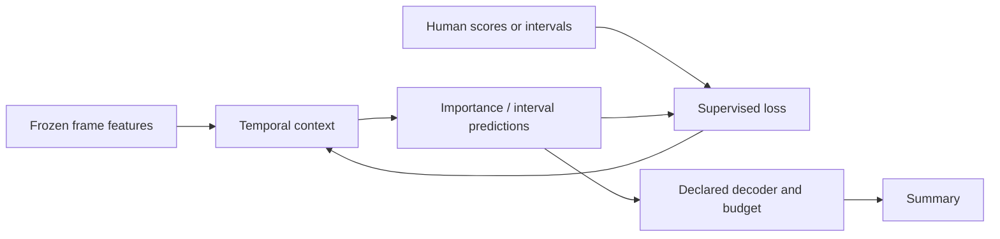

# Classical and supervised methods

[Home](../README.md) · [Paper catalog](generated/papers.md) · [Benchmarks](12-benchmarks.md)

Supervised summarization learns from human importance or summary choices. It predates deep networks: a structured subset model can learn which combinations humans prefer. Classical and learned systems share the need to balance coverage, diversity, temporal continuity, and a finite budget.

## Clustering, sparse selection, and facility location

[VSUMM](https://ic.unicamp.br/~sandra/pdf/papers/avila_PRL11.pdf) represents an accessible clustering/keyframe route. It produces a static summary; converting keyframes into full shots changes the output and metric. Its [author repository](https://github.com/sandraavila/vsumm) provides data and reference summaries, not evidence that it is a modern neural training package.

A **repository abstraction** for sparse self-representation collects frame descriptors in columns of $`X`$ and selects representative rows of coefficient matrix $`C`$:

```math
\min_C \|X-XC\|_F^2+\lambda\|C\|_{2,1},\qquad
\|C\|_{2,1}=\sum_i\|C_{i,:}\|_2.
```

Concentrating coefficient mass in a few rows encourages a small dictionary of frames. This convex relaxation is not the exact objective of [minimum sparse reconstruction](https://www.sciencedirect.com/science/article/pii/S0031320314002933), which explicitly uses an $`L_0`$ constraint. Sparsity is not a duration constraint; an additional decoder remains necessary for skims.

A **canonical facility-location objective** with nonnegative similarities is

```math
f(S)=\sum_{t=1}^T\max_{i\in S}k(x_t,x_i),\qquad f(\varnothing)=0.
```

It is monotone submodular: the gain from another representative diminishes as coverage improves. The familiar greedy $`1-1/e`$ guarantee applies to a cardinality constraint, not automatically to arbitrary duration-greedy code or objectives with negative redundancy terms. [Gygli, Grabner and Van Gool](https://openaccess.thecvf.com/content_cvpr_2015/html/Gygli_Video_Summarization_by_2015_CVPR_paper.html) learn a mixture of summary objectives from annotated data; “classical” therefore does not imply “unsupervised.”

## DPP and sequential supervision

[seqDPP](https://www.cs.utexas.edu/~grauman/papers/nips14_seqdpp.pdf) introduces temporal structure into diverse subset learning. A conventional DPP is permutation-invariant, so the sequential factorization matters for ordered video. The [DPP likelihood](01-foundations.md#53-determinantal-point-processes) separates quality from similarity. Learn quality and similarity against a reference subset; at deployment, exact MAP inference is generally different from sampling a DPP or ranking its diagonal.

[Zhang et al., ECCV 2016](https://arxiv.org/abs/1605.08110) combine bidirectional temporal modeling with frame-score supervision and a DPP component. Read vsLSTM and dppLSTM as variants of one paper. The [author code](https://github.com/kezhang-cs/Video-Summarization-with-LSTM) uses a legacy Python/Theano/MATLAB workflow; a port must retain feature preprocessing and reference construction to support comparison.

For score regression, the following is an **explanatory abstraction**, not a substitute for each paper's exact normalization:

```math
\mathcal L_{\mathrm{score}}=\frac{1}{T}\sum_t(s_t-h_t)^2,
\qquad
\mathcal L=\mathcal L_{\mathrm{score}}+\lambda\mathcal L_{\mathrm{DPP}}.
```

Here $`h_t`$ is a human-derived target. For multiple annotators, predicting the mean and learning a distribution over individual choices are distinct tasks. [SummDiff](04-reconstruction-generative.md#13-supervised-diffusion-summdiff) takes the latter route with supervised diffusion.

## Temporal convolution and segment detection

[SUM-FCN](https://arxiv.org/abs/1805.10538) casts temporal summarization as fully convolutional sequence prediction. Its supervised and reconstruction-based variants must be recorded separately. The [reconstruction chapter](04-reconstruction-generative.md#91-sum-fcn_unsup) explains the label-free variant and limitations of the community implementation.

[DSNet](https://github.com/li-plus/DSNet) frames supervised summarization as temporal interest detection, with anchor-based and anchor-free variants. Importance and boundary predictions support intervals rather than independently scored frames alone. Proposal thresholds, nonmaximum suppression, and final budget conversion are part of the system; copying only its network into a frame-ranking pipeline is not a reproduction. Its archival publication is **IEEE TIP 2021**, not AAAI.



## A controlled supervised experiment

Use the same published train/test IDs, encoder tensor, shot boundaries, summary budget, and evaluator for an attention baseline and a recurrent baseline. Keep validation labels separate from final test labels. Report variation across seeds, all tested videos, and how annotators are aggregated. The [implementation guide](13-implementations.md) records source-level differences; the [benchmark catalog](12-benchmarks.md) retains the primary table locations and uncertainty.
