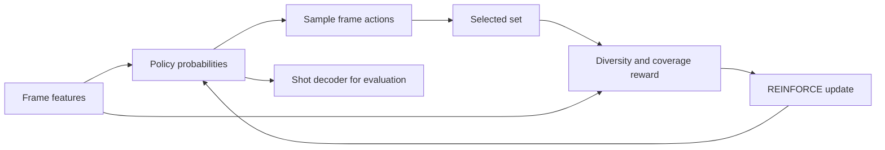

# Reinforcement learning and heuristic selection

[Home](../README.md) · [Foundations](01-foundations.md) · [Implementations](13-implementations.md)

## DR-DSN and the selected-set reward

[Zhou, Qiao and Xiang, AAAI 2018](https://arxiv.org/abs/1801.00054) model frame inclusion as Bernoulli actions, with diversity and representativeness rewards. The policy is recurrent, but its primary training signal is a reward rather than reconstruction. The paper also evaluates a supervised variant; use the unsupervised rows only when making a label-free comparison.

For selected set $`S`$, a simplified **equivalent presentation** of its feature coverage reward is

```math
R_{\mathrm{rep}}=\exp\left(-\frac1T\sum_{t=1}^T\min_{i\in S}\|x_t-x_i\|_2^2\right).
```

Diversity averages pairwise dissimilarity. The paper modifies distant temporal pairs rather than treating all pair distances identically; preserve that temporal rule and empty/singleton behavior in a reproduction. The [official implementation](https://github.com/KaiyangZhou/pytorch-vsumm-reinforce) is the starting point for exact reward and post-processing details.

The **policy-gradient identity** is

```math
\nabla_\theta\mathbb E_{a\sim\pi_\theta}[R(a)]
=\mathbb E[(R(a)-b)\nabla_\theta\log\pi_\theta(a)].
```

A baseline $`b`$ reduces variance when it is independent of the sampled action conditional on state; if learned, its gradients must not contaminate the policy estimator. Add the paper's mean-inclusion regularizer separately. Neither reward maximization nor a soft length target guarantees the final duration budget.



## Actor–critic hybrids

[AC-SUM-GAN](04-reconstruction-generative.md#11-ac-sum-gan-actorcriticreconstruction-hybrid) uses an actor for sequential fragment choices and a critic for return estimates; its reconstruction quality defines the reward. Cross-index it under both mechanisms. A **canonical actor–critic abstraction** is

```math
A_t=G_t-V_\phi(s_t),\qquad
\mathcal L_\pi=-\sum_t\log\pi_\theta(a_t\mid s_t)\,\mathrm{stopgrad}(A_t),
\qquad
\mathcal L_V=\sum_t(G_t-V_\phi(s_t))^2.
```

The chapter above preserves that paper's exact reward, entropy term, discount, and training-loop details. This generic equation is not a claim that all summarization actors share those choices.

### Personalized day-long actor–critic selection

[Generating Personalized Summaries of Day Long Egocentric Videos](https://doi.org/10.1109/TPAMI.2021.3118077) applies policy-gradient, Q-learning and actor–critic variants to binary decisions over non-overlapping 16-frame sub-shots. Distinctiveness, indicativeness and requested length form the base reward; face/social-interaction/identity cues and positive or negative user examples add personalization. Sliding windows plus four whole-video passes make it a day-long method, but not a strictly causal one-pass stream.

Interpret its protocols separately. Disney/UTE long-video experiments include RFS-50, which depends on a 50-unit temporal relaxation over the summary/sub-shot indexing, while ancillary SumMe/TVSum experiments use ordinary 15%-budget F1. Only three Disney videos have three-annotator reference summaries, and the personalization study has ten users. The [author code](https://github.com/Pravin74/interact_summ_code/tree/b18da63203581c532eb4ad50ad7837fee3f300e6) requires manually prepared C3D HDF5 and a legacy environment; it was inspected, not run.

## Heuristics worth keeping

Constant scores, seeded random scores, uniformly spaced keyframes, cluster representatives, and duration-aware facility location answer different questions. Keep all relevant ones: a learned selector should improve over a temporal prior under the same decoder. Equal-length segmentation and uniform keyframes are not synonyms.

[Diversity Promoting Online Sampling](https://arxiv.org/abs/1610.09582) is a useful causal heuristic reference: its online-K-means generalization maintains K exemplars in one pass, uses a combined clustering/diversity cost to choose a candidate and normally accepts replacement when convex-hull diversity improves; forced updates on 1–10% of samples add noise to escape local minima. Online K-medoids is a separate baseline. Its reported experiment is not a clean generic baseline, however: every video receives a frozen 500-frame suffix, K comes from the longest human reference, and the score is a modified normalized-match metric. Reuse the streaming idea, not its number as if it were standard VSUMM F1.

Run `python3 examples/summary_baselines.py --demo` from the repository root. The synthetic example holds segmentation and budget fixed and compares constant/random scores and mean/sum pooling. Its [tests](../tests/test_baselines.py) compare exact knapsack to exhaustive subset enumeration, demonstrate a greedy counterexample, and check reference aggregation. It is a teaching implementation, not a reproduced paper score.

## Reward audit

Check whether a reward favors visual outliers, long repetitive scenes, or classifier confidence rather than human relevance. Inspect whether training reads `gtscore`, whether validation F1 picks checkpoints, and whether a “label-free” model uses a best test seed. Report inference cost separately from the number of policy rollouts used for training.
