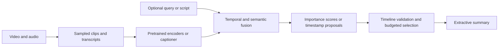
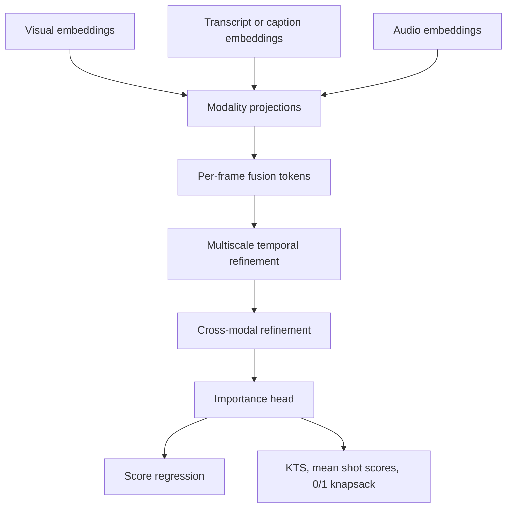

# Foundation models, multimodal fusion, and training-free summarization

[Back to handbook](../README.md) · [Task settings](11-task-settings.md) · [Structured paper records](../data/papers/modern.json)

**Verified: 2026-09-08.** These methods share pretrained representations, but their learning signals differ. Read the supervision column before comparing their results. Official code means author-linked code was found; it does not mean this repository reproduced the model.

## 1. What a foundation model contributes

There are three useful starting points:

| Approach | Where semantics enters | What still needs checking |
|---|---|---|
| Frozen visual/text encoders | Frame, caption, transcript, or query embeddings | Whether the selector is trained against human summaries |
| Caption-and-score pipeline | A video-language model describes scenes; an LLM judges their relevance | Caption omissions, prompt calibration, model version, and final segment selection |
| Instruction-tuned video model | A decoder emits frame indices, text, or both | Summarization fine-tuning data, temporal grounding, and output validation |

A frozen backbone is compatible with a supervised selector. Similarly, no gradient updates at inference do not rule out labeled examples in prompt design. [LLMVS](https://arxiv.org/abs/2504.11199), [V2Xum-LLM](https://arxiv.org/abs/2404.12353), and [CoE](https://arxiv.org/abs/2603.06213) illustrate these separate cases.

The following diagram is an interface blueprint, not the architecture of a particular paper:



For implementations, keep raw timestamps, sampled-frame indices and model tokens in separate fields. A generated frame index refers to the sampled timeline until explicitly mapped back to source time. A text summary needs a separate evaluation record from a selected-video summary.

## 2. Core reading sequence

| Paper | Why read it | Learning signal | Author code |
|---|---|---|---|
| [VideoXum / VTSUM-BLIP](https://arxiv.org/abs/2303.12060) — Jingyang Lin, Hang Hua, Ming Chen, Yikang Li, Jenhao Hsiao, Chiuman Ho, Jiebo Luo; IEEE TMM 2024, accepted 2023 | Joint visual and textual output, shared video representation, and a purpose-built benchmark | Frame BCE and text-generation negative log likelihood | [Official PyTorch](https://github.com/jylins/videoxum) |
| [A2Summ](https://arxiv.org/abs/2303.07284) — Bo He, Jun Wang, Jielin Qiu, Trung Bui, Abhinav Shrivastava, Zhaowen Wang; CVPR 2023 | Timestamp alignment, modality-specific processing, and dual contrastive regularization | Supervised focal classification plus contrastive losses | [Official PyTorch](https://github.com/boheumd/A2Summ) |
| [Scaling Up Video Summarization Pretraining with Large Language Models](https://arxiv.org/abs/2404.03398) — Dawit Mureja Argaw, Seunghyun Yoon, Fabian Caba Heilbron, Hanieh Deilamsalehy, Trung Bui, Zhaowen Wang, Franck Dernoncourt, Joon Son Chung; CVPR 2024 | LLM-generated summary targets and autoregressive visual-summary decoding | Pseudo-summary feature regression; target fine-tuning is a separate setting | Public author release not independently verified |
| [V2Xum-LLM](https://arxiv.org/abs/2404.12353) — Hang Hua, Yunlong Tang, Chenliang Xu, Jiebo Luo; AAAI 2025 | Interleaved frame/timestamp prompts; one language decoder for visual and textual outputs | Supervised instruction tuning, including machine-assisted data | [Official PyTorch](https://github.com/hanghuacs/V2Xum-LLM) |
| [LLMVS](https://arxiv.org/abs/2504.11199) — Min Jung Lee, Dayoung Gong, Minsu Cho; CVPR 2025 | Local LLM reasoning followed by a learned global importance model | Supervised mean squared error | [Official PyTorch](https://github.com/mlee47/LLMVS) |
| [TripleSumm](https://arxiv.org/abs/2603.01169) — Sumin Kim, Hyemin Jeong, Mingu Kang, Yejin Kim, Yoori Oh, Joonseok Lee; ICLR 2026 | Adaptive visual/text/audio fusion and explicit TV versus TVT evaluation | Human or replay-derived score targets | [Official PyTorch](https://github.com/smkim37/TripleSumm) |

### VideoXum: paired outputs change the objective

The VTSUM-BLIP baseline shares video representations between a visual-summary head and a text decoder. Section IV-B uses binary cross-entropy for frame inclusion and autoregressive negative log likelihood for the textual summary. A useful mathematical shorthand is

```math
\mathcal L_{\mathrm{visual}}=\mathrm{BCE}(\hat y,y),\qquad
\mathcal L_{\mathrm{text}}=-\sum_i\log p(w_i\mid w_{<i},V).
```

The paper describes selecting the top 15% of frames. The inspected [F1 helper](https://github.com/jylins/videoxum/blob/11bd4fe3fb51b7dc804dd1519a4914f67bff60df/utils.py#L275-L281) instead includes every score at or above the zero-based threshold `floor(0.15*N)`: it selects `floor(0.15*N)+1` frames when scores are distinct, and potentially more with ties. Preserve this difference between the intended budget and released evaluation behavior. The [evaluation script](https://github.com/jylins/videoxum/blob/11bd4fe3fb51b7dc804dd1519a4914f67bff60df/eval_v2vt_sum.py#L60-L68) computes F1 separately against each human mask, but computes rank correlations against the mean of ten masks. See the [implementation audit](13-implementations.md#multimodal-and-query-focused-code) before comparing this frame protocol with KTS keyshot evaluation.

The dataset partition is 8,000 training, 2,001 validation and 4,000 test videos. Use the archival **2024** journal year; the repository's TMM 2023 label reflects its earlier acceptance timeline. [Paper, Sections III-A and IV](https://arxiv.org/html/2303.12060v3) · [Official project and model zoo](https://videoxum.github.io/).

### A2Summ: contrastive is not automatically self-supervised

A2Summ aligns transcript sentences with the frames in their time intervals, then uses alignment-guided self-attention and modality experts. Its classification targets are annotated keyframes/key sentences, and its intra-sample contrastive positives also depend on ground-truth summaries. Thus the complete model belongs in supervised comparisons. Contrastive regularization describes its mechanism, not the absence of labels. The author project provides a [presentation, slides and poster](https://boheumd.github.io/A2Summ/); the full objective is in [Section 3.4](https://arxiv.org/html/2303.07284v3).

### LfVS: distinguish pseudo-summary prediction from input reconstruction

Argaw and colleagues retain timestamps while asking an LLM to summarize transcripts, then map the selected sentences back to video. A multimodal encoder-decoder learns to predict those **summary** features; Eq. (10) minimizes squared error including the end-of-sequence token. At inference, nearest-neighbor retrieval maps decoded representations to source moments. This is externally supervised target construction, even though annotation is automated. It is not the same objective as reconstructing the complete source video from a bottleneck. [Primary method, Sections 3–4](https://arxiv.org/html/2404.03398v1).

### LLMVS and V2Xum-LLM: two routes from language to selection

LLMVS uses LLaVA captions and Llama-2 local context embeddings, followed by a self-attention aggregator trained against human importance scores. V2Xum-LLM trains its adapter and decoder to emit temporal indices and/or natural language. Their supervised objectives are, respectively, frame-score MSE and output-token negative log likelihood. Freeze status of the captioner or visual encoder does not change these selector-level categories. [LLMVS, Sections 3.3–3.5](https://arxiv.org/html/2504.11199v2) · [V2Xum-LLM, Methodology and Training](https://arxiv.org/html/2404.12353v3).

## 3. TripleSumm: exact identity and protocol audit

The verified title is **TripleSumm: Adaptive Triple-Modality Fusion for Video Summarization**, by **Sumin Kim, Hyemin Jeong, Mingu Kang, Yejin Kim, Yoori Oh, and Joonseok Lee**, published at **ICLR 2026**. The arXiv identifier is **2603.01169**. Exact-name searches for “Triple-Sum”, “Triple Sum” and “Triplet-Sum” did not establish a separate video-summarization paper. Preserve the verified spelling; do not create aliases as separate citations. [Paper](https://arxiv.org/abs/2603.01169) · [ICLR paper](https://openreview.net/pdf?id=x74NsHGywD).



The main method alternates temporal attention within modalities and fusion across modalities. Its training objective is

```math
\mathcal L(S,\widehat S)=\lVert S-\widehat S\rVert_2^2
```

against importance targets. It is **supervised** on human-annotated datasets and uses behavioral weak supervision on MoSu. MoSu pretraining followed by target fine-tuning is distinct from direct transfer. The main results separate traditional TV folds from TVT folds with dedicated validation and test partitions. [Sections 3.3 and 5.1; Appendix B.5](https://arxiv.org/html/2603.01169v1).

The [author project](https://sumin-kim.com/TripleSumm-page/) introduces MoSu, a 52,678-video dataset with synchronized visual, text and audio features, and interactive examples of modality contributions. Replay statistics measure viewer behavior; they should not be described as independent human judgments of summary quality. The [code repository](https://github.com/smkim37/TripleSumm) links datasets and MoSu/Mr. HiSum checkpoints, with Python 3.10, PyTorch 2.5.1 and CUDA 12.1 instructions. These artifacts were inspected, not executed here.

Three reporting traps require particular care:

- **Table 3 “Ours (MoSu)” includes target fine-tuning.** Only the separate Table 5 long-video experiment is direct MoSu-to-new-video transfer. A zero-shot transfer label does not imply that the selector was never trained.
- **Main Table 2 and Appendix D prose disagree on the MoSu rank values.** Appendix Table XI agrees with the main table. Preserve the table identifier beside any copied number; do not silently select the higher prose claim. Correlations, highlight mAP and final keyshot overlap are separate evaluations. [Primary tables and appendices](https://arxiv.org/html/2603.01169v1).
- **External-dataset captioner names differ.** Section 5.1 names `Qwen2.5-VL-7B-Instruct`, while Appendix B.4 links `Qwen/Qwen2-VL-7B-Instruct`. Resolve the actual caption cache and model revision before reproducing these experiments. [Primary preprocessing descriptions](https://arxiv.org/html/2603.01169v1).

## 4. Training-free pipelines and the data used to design them

| Work | Actual output and inference | Qualification needed |
|---|---|---|
| [Prompts to Summaries](https://arxiv.org/abs/2506.10807), Mario Barbara and Alaa Maalouf; arXiv 2025, revised 2026 | Scene captions and prompted judgments become frame scores; optional natural-language query | No selector gradient training, but SumMe and TVSum use different normalization selected through dataset experiments |
| [Context-Aware Pseudo-Label Scoring](https://arxiv.org/abs/2510.17501), Yuanli Wu, Long Zhang, Yue Du and Bin Li; arXiv 2025 | Captions and contextual rubric prompts produce importance scores | Human-annotated examples help construct the rubric; label-assisted calibration, despite the zero-shot title |
| [Cut to the Chase / CoE](https://arxiv.org/abs/2603.06213), Xiaoxing You, Qiang Huang, Lingyu Li, Xiaojun Chang and Jun Yu; CVPR 2026 | Event graph, visual grounding and event evolution produce a textual summary | No gradient training; five training-set summaries serve as style references |

**Prompts to Summaries.** Sections 3.3–3.4 define scene judgment, score normalization, temporal smoothing, and frame consistency/uniqueness weighting. The standard-video experiments use a 15% duration budget, but VidSum-Reason uses 36%; do not merge these results. Its [official implementation](https://github.com/mario998-hash/ZeroShotVideoSummary) requires a video-language model and an OpenAI API key. The README retains an older clone URL, so use the paper-linked repository and check configuration against the inspected revision. [Primary methodology and protocol](https://arxiv.org/html/2506.10807v3).

**Context-Aware Pseudo-Label Scoring.** Section 3 explicitly starts with a small human-annotated subset and creates dataset-specific rubrics before inference. A clean reproduction needs the identities of those examples and evidence that evaluation videos were excluded from rubric design. The current manuscript also contains placeholder venue metadata and inconsistent baseline attributions. Its [author-linked code](https://github.com/wuyuanli60-svg/Context-Aware-Pseudo-Label-Scoring-for-Zero-Shot-Video-Summarization) is useful for inspecting prompts, but no headline numerical comparison is accepted here. [Primary paper, Sections 3–4](https://arxiv.org/html/2510.17501v3).

**CoE.** Section 3 structures summarization through a hierarchical event graph, cross-modal grounding, event-evolution reasoning and domain-adaptive generation. Section 4.1 selects five reference summaries from training data for style adaptation. Its output is text; entity F1, ROUGE and BERTScore do not measure temporal overlap of selected keyshots. The [official code](https://github.com/youxiaoxing/CoE) includes graph construction and evaluation but also needs dataset preparation, MongoDB and model-serving configuration. [Primary paper](https://arxiv.org/html/2603.06213v1).

## 5. Reproduction and open questions

For each foundation-model run, record model/checkpoint identifiers, prompt text, sampling timeline, decoding parameters, example provenance, caption/transcript cache hashes, API usage and cost, and the final selection procedure. Measure feature extraction and captioning separately from selector latency. Model availability and benchmark contamination remain unverified unless independently audited.

The most useful open questions are testable: does direct visual evidence rescue events lost by the captioner; do normalization choices survive a held-out dataset; does adaptive audio fusion help beyond speech; and do semantically plausible textual summaries preserve causal order and exact timing? The current ledger provides representative starting points, not an exhaustive 2026 survey or independently reproduced leaderboard.
