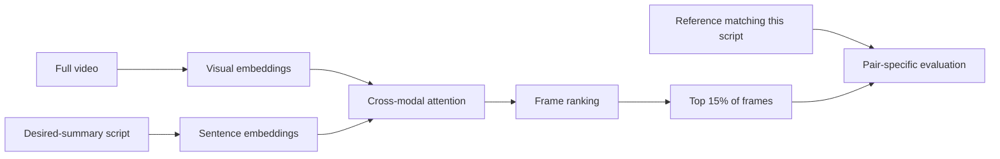

# Query, personalized, long-form, and online settings

[Back to handbook](../README.md) · [Foundation models](10-foundation-models.md) · [Evaluation](02-evaluation.md) · [Paper records](../data/papers/modern.json)

**Verified: 2026-09-19.** A system's task is defined by its inputs, permitted context, output and evaluation target. Architecture alone cannot tell us whether two results measure the same problem.

## 1. Choose the task before the metric

| Setting | Conditioning information | Typical output | What to evaluate |
|---|---|---|---|
| Generic extractive | Video, optionally synchronized audio/transcript | Keyframes or keyshots | Coverage, redundancy, temporal overlap, rank agreement |
| Query-focused | Video plus a question, concept pair or natural-language query | Relevant and representative moments | Query relevance and coverage under a stated budget |
| Script-driven | Video plus a description of the desired summary | A video matching the script | Correspondence to that script's particular reference |
| Personalized | User preferences or interaction/history | User-specific selection or fast-forward playback | Preference satisfaction, continuity and adaptation |
| Multimodal textual | Video plus transcript/article | Text | Factual grounding, event coverage and coherence |
| Online/streaming | Only the prefix available at decision time | Incremental selection | Quality under latency, look-ahead and memory constraints |

These are operational distinctions used by this handbook. Query/script conditioning is exemplified by [SD-VSum](https://arxiv.org/abs/2505.03319); preference-controlled playback by [EdgeVidSum](https://arxiv.org/abs/2506.03171); textual multimodal output by [CoE](https://arxiv.org/abs/2603.06213). The streaming row is an audit requirement, not a claim that these papers implement a causal streaming model.

## 2. Query-focused is more than finding a matching frame

A query can name a concept, describe an event, or express an abstract preference. A retrieval system may return one highly relevant interval. A summarizer also needs to manage repetition, coverage, chronology and duration. Keep retrieval metrics and summarization metrics separate even when they use the same visual/text embeddings.

[Prompts to Summaries](https://arxiv.org/abs/2506.10807) adds user intent to an LLM scene-scoring prompt and evaluates both QFVS and its VidSum-Reason benchmark. These settings have different queries and budgets. In particular, its VidSum-Reason experiments use a 36% summary budget and fragments representing 3% of video duration; that result is not a standard 15% SumMe/TVSum result. Record the exact query text and evaluate each query-reference pair. [Protocol details](https://arxiv.org/html/2506.10807v3).

[CLIP-It!](https://proceedings.neurips.cc/paper/2021/hash/7503cfacd12053d309b6bed5c89de212-Abstract.html) is an important bridge: generated captions condition generic SumMe/TVSum selection, while free-form text conditions QFVS selection. Its QFVS experiment uses four leave-one-video-out rounds and fixed 5-second shots. Ground-truth-caption oracle rows, generated-caption rows, supervised training and the no-BCE variant are different settings. The official repository is only a “code coming soon” stub, and the available community source is not an end-to-end reproduction.

A useful small study is to vary one query while keeping video, sampling, budget and model fixed. Compare the selected moments and inspect whether the change reflects the requested content rather than generic visual salience. This is a proposed exercise, not a published benchmark result.

## 3. SD-VSum: a full script changes the reference

**SD-VSum: A Method and Dataset for Script-Driven Video Summarization** — **Manolis Mylonas, Evlampios Apostolidis, Vasileios Mezaris**, **ACM Multimedia 2025**. [Paper](https://arxiv.org/abs/2505.03319) · [DOI](https://doi.org/10.1145/3746027.3755821) · [Official PyTorch code, data and checkpoint](https://github.com/IDT-ITI/SD-VSum).

S-VideoXum pairs each human-selected summary with a machine-generated script describing it. Frozen CLIP representations feed cross-modal attention and a Transformer frame scorer. The script-driven model uses BCE against the matching annotator's binary summary; the generic variant uses MSE against the average reference scores. Inference takes the top 15% of frames. Evaluation averages each script-summary pair's F1, then averages over videos. It must not take the best match among unrelated references. [Sections 3–5](https://arxiv.org/html/2505.03319v2).

The [released dataset instructions](https://github.com/IDT-ITI/SD-VSum) include feature H5 files, annotations and split JSON. Reproduction should preserve video-level partitions before expanding videos into multiple script pairs; otherwise different summaries of the same source can appear across development and evaluation. At the inspected commit, however, the loader requests `gtscores` while both the dataset documentation and committed S-NewsVSum HDF5 expose `gtsummaries`; validation/test loading also drops dataset/split arguments. These are concrete blockers, not a claim that the published method is invalid.

## 4. Personalization and the boundary with online processing

**EdgeVidSum: Real-Time Personalized Video Summarization at the Edge** — **Ghulam Mujtaba, Eun-Seok Ryu**, **CVPR 2025 demo and arXiv report**. The [conference program](https://media.eventhosts.cc/Conferences/CVPR2025/CVPR_main_conf_2025.pdf) lists it as a demo; do not cite it as a main-track benchmark paper. [Report](https://arxiv.org/abs/2506.03171) · [Author poster](https://gmujtaba.com/assets/pdf/cvpr25_poster_EdgeVidSum.pdf).

The system analyzes pre-generated thumbnail containers with an EfficientNetV2 backbone, triplet attention and a supervised activity classifier. User preferences select content for variable-speed playback. The report's classifier uses cross-entropy, while its demo runs on Jetson Nano. Public author code, training-set manifest and evaluation splits were not established in this audit. [Sections 3–4](https://arxiv.org/html/2506.03171v1).

“Real-time” interaction with thumbnails for an already available video does not demonstrate decisions from an incoming stream. Report thumbnail generation, transfer and playback costs separately. Whole-video preprocessing can be useful, but its context advantage must be explicit.

[Generating Personalized Summaries of Day Long Egocentric Videos](https://doi.org/10.1109/TPAMI.2021.3118077) uses actor-critic and related RL policies over 16-frame sub-shots, with reward plug-ins for social interaction, identities and positive/negative user examples. Its variable-length, multi-pass day-long setting is stronger evidence of interactive personalization than a preference filter, but only three Disney videos have three-annotator reference summaries and the user study has ten participants. Its RFS-50 score uses a temporal tolerance and must not be mixed with ordinary 15%-budget F-score. The [author code](https://github.com/Pravin74/interact_summ_code) requires manual C3D feature preparation and a legacy PyTorch/CUDA stack.

TRINITY's phrase “personal-style” has a narrower meaning: the requested style is one of three constructed Event, Emotion or Nature perspectives. It does not learn a particular person's history or adapt from feedback. Treat its per-perspective mAP as a multi-task highlight benchmark, not evidence of individualized recommendation.

A causal streaming experiment needs at least:

- Input access: which past frames and how much look-ahead are permitted.
- Decision policy: whether selected moments can be retracted or revised.
- Resource limits: memory, processing rate and end-to-end latency.
- Budget policy: fixed duration, rolling-window capacity or unknown final length.
- Quality protocol: compare against an offline method with its context advantage stated.

The historical [Diversity Promoting Online Sampling](https://arxiv.org/abs/1610.09582) does consume frames in a single causal pass while retaining K exemplars. It therefore closes the conceptual streaming gap, but its reported VSUMM protocol freezes the last 500 frames of every video, derives K from the longest human reference and uses a modified normalized-match metric. It is a method reference, not a clean modern benchmark. SVMemAgent and related streaming memory selectors remain adjacent because they are evaluated through VideoQA rather than summary quality. The fact that A2Summ uses livestream source videos also does not establish online inference: its model uses aligned sequences and global context. [A2Summ](https://arxiv.org/html/2303.07284v3).

## 5. Long-form is a context and evaluation problem

Duration alone is insufficient. A long instructional video with tightly aligned speech is a different challenge from a movie with delayed plot resolution or an egocentric stream with sparse query-relevant events.

| Resource | What the paper contributes | Boundary to preserve |
|---|---|---|
| [LfVS-P / LfVS-T](https://arxiv.org/abs/2404.03398) | Pseudo-summary pretraining and a 1,200-video professionally annotated test benchmark | Instructional speech/visual alignment affects how targets are generated |
| [BLiSS / A2Summ](https://boheumd.github.io/A2Summ/) | Livestream video/transcript pairs with visual and textual summaries | Source videos can be long while released modeling units and context windows are shorter |
| [TripleSumm long-video test](https://arxiv.org/html/2603.01169v1) | Direct transfer from MoSu to 50 longer unseen videos | Transfer uses an already trained selector; Table 3 target fine-tuning is a separate setting |
| [CoE](https://arxiv.org/abs/2603.06213) | Text generation across news, lecture, sports, livestream and TV domains | Text metrics and few-shot style references differ from extractive duration-budget protocols |
| [Personalized day-long egocentric summaries](https://doi.org/10.1109/TPAMI.2021.3118077) | Sliding-window/four-pass RL with variable requested duration | References cover only three Disney videos; UTE/HUJI have different annotation/evaluation roles |
| [KnowVis](https://arxiv.org/abs/2609.03742v2) | Lecture transcript/slides become concept-level generated visual narratives | No temporal skim, no held-out split, proprietary generators and only ten human-study participants |
| [Unified Agentic Video Editing](https://arxiv.org/abs/2609.12769v1) | Five TV episodes become 90–110-second narrated audiovisual summaries | Agents use private hierarchical metadata rather than raw video; evaluation is LLM-answered comprehension |

For a practical long-video design, measure the cost and failure cases of sampling, chunking, memory, transcript alignment and final editing separately. Test whether a short decisive event survives sampling and whether chunk boundaries break cause-and-effect relationships. Any hierarchical method should document what information is discarded at each level.

## 6. Domain coverage and useful extensions

Sports highlights reward task-specific events; lecture summaries often require speech and slide text; egocentric summaries can require user intent; surveillance summaries can emphasize rare events. A generic keyshot benchmark does not validate all these goals. Recent sports examples make the distinction concrete: an audio/visual GRU study ranks 2-second clips on paper-local SV-Highlights splits, Semantic Action Graph composes five personalized clips from a privileged match feed, and a modular soccer pipeline turns detected events into a duration-constrained knapsack. None shares a protocol with SumMe/TVSum, and the soccer paper's end-to-end table is event-detection F1 rather than summary overlap.

This release provides routes into query/script conditioning, multimodal text generation, long-form transfer, personalized RL and causal online selection. Dedicated benchmark-and-code audits for medical/procedural video, multi-camera surveillance, multilingual output and modern streaming systems remain open work. To extend a domain, first establish an authoritative dataset, target definition and evaluation protocol; then add code with its license, preprocessing and checkpoint provenance. Do not infer domain performance from an unrelated SumMe/TVSum score.

## 7. Multi-video and co-summarization

[Chu, Song and Jaimes, CVPR 2015](https://people.csail.mit.edu/yalesong/publications/ChuSJ2015CVPR.pdf) introduced **video co-summarization by visual co-occurrence**. Topic-related videos provide context for one another: a shot gains importance when similar content occurs across the group. Their maximal biclique method selects sparse, mutually similar shot groups in a bipartite graph; its relaxed objective trades co-occurrence against sparsity, optimized by alternating updates. It produces ranked shots for each video. A single compiled film assembled from multiple sources is a further editorial task with different continuity and redundancy requirements.

The [CoSum release](https://github.com/l2ior/cosum) supplies video URLs, annotations and shot indices; it does not establish a runnable implementation of the full algorithm. Its top-5/top-15 shot mAP should remain separate from temporal summary F1. In a reproduction, preserve the topic-group membership and state which companion videos are visible at inference: changing the collection changes the information used to score each shot. As a proposed diagnostic, remove one companion video and inspect which selected events disappear; this exposes dependence on shared content versus video-specific importance.

## 8. Historical query-focused summarization: QFVS

[Sharghi, Laurel and Gong, CVPR 2017](https://arxiv.org/pdf/1707.04960) combined query-to-frame memory-network attention with a sequential DPP, learning summary likelihood from query-conditioned references. QFVS adds concept and summary annotations to four UTE recordings; it is an annotation layer on existing videos. Its concept-IoU bipartite-matching F1 measures semantic agreement between selected shots. The main experiment used unconstrained output lengths; separate 10/20-shot annotations were reserved for later study. Record which reference version a modern QFVS experiment uses. The paper-linked release endpoint was unavailable during this audit, so current annotation access and executable author code remain unverified. Full method/access records for this paper, CoSum, SummScreen and Hierarchical3D are in the [specialized paper registry](../data/papers/specialized.json).
